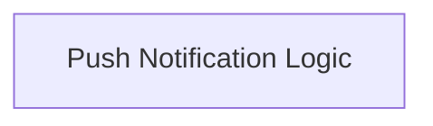

# Push Notification Logic Module

## Introduction and Purpose
The `push_notification_logic` module is a crucial component within the Agent-to-Agent (A2A) communication system, specifically handling updates through push notifications (webhooks). Its primary purpose is to manage the asynchronous flow of task execution and status updates between agents, ensuring that the initiating agent receives timely information about the delegated task's progress and final result.

This module encapsulates the core logic for sending initial messages, registering for push notifications, and then polling a result store for the final outcome. It handles various scenarios, including configuration errors, HTTP communication issues, and unexpected errors during the push notification process.

## Architecture Overview
The `push_notification_logic` module is primarily composed of two core elements: `PushNotificationHandlerKwargs` and `PushNotificationHandler`. The `PushNotificationHandler` orchestrates the push notification workflow, utilizing the configuration defined by `PushNotificationHandlerKwargs`.

It interacts with the `a2a_event_system` to emit various events related to connection errors, registration, and task state changes. The module also relies on a `PushNotificationResultStore` (an external dependency not detailed here) for storing and retrieving task results.

<!-- DIAGRAM_JSON
{
    "direction": "TD",
    "nodes": [
        {"id": "push_notification_logic", "label": "Push Notification Logic", "type": "module", "link": "push_notification_logic.md"}
    ],
    "edges": [],
    "groups": []
}
-->

## Core Functionality

### PushNotificationHandlerKwargs
This component defines the keyword arguments expected by the `PushNotificationHandler`. It includes critical configuration parameters such as:
- `config`: An instance of `PushNotificationConfig` (not part of this module's core components) containing the callback URL for push notifications.
- `result_store`: An implementation of `PushNotificationResultStore` used to store and retrieve results of tasks delegated via push notifications.
- `polling_timeout`: The maximum time to wait for a push notification result.
- `polling_interval`: The interval at which the result store is polled for updates.

These kwargs ensure that the handler has all necessary information to operate correctly.

### PushNotificationHandler
This is the main logic handler for push-notification-based updates. Its `execute` method performs the following key steps:
1. **Validation**: Checks if `PushNotificationConfig` and `PushNotificationResultStore` are provided in the kwargs. If not, it emits an `A2AConnectionErrorEvent` and returns a failed task state.
2. **Message Sending**: Delegates the initial message sending to the A2A client's `send_message` method, collecting any intermediate messages.
3. **Task ID Retrieval**: Extracts a `task_id` from the result of the message sending. If the result is not a `task_id` (e.g., an immediate result), it processes it directly.
4. **Event Emission**: Emits an `A2APushNotificationRegisteredEvent` to signal that a push notification callback has been configured for the task.
5. **Result Polling**: Enters a polling loop using `_wait_for_push_result` to periodically check the `result_store` for the final task status, respecting the `polling_timeout` and `polling_interval`.
6. **Result Processing**: Once a final task state is received, it processes the task state and constructs a `TaskStateResult`.
7. **Error Handling**: Includes robust error handling for `A2AClientHTTPError` and other general exceptions, emitting appropriate `A2AConnectionErrorEvent`s and returning failed task states.

This handler is central to enabling reliable asynchronous communication and task result delivery through webhooks in the A2A system.

## Relationships to Other Modules
- **[crewai_agent_to_agent_communication](crewai_agent_to_agent_communication.md)**: This module is a direct child of the `a2a_update_handlers` submodule, which is part of the broader `crewai_agent_to_agent_communication` module. It plays a vital role in how agents exchange information and updates asynchronously.
- **[crewai_event_system](crewai_event_system.md)**: The `PushNotificationHandler` heavily relies on the `CrewAIEventsBus` to emit various A2A-specific events, such as connection errors and push notification registration. These events are crucial for monitoring and debugging A2A interactions.
- **External Configuration and Storage**: It depends on `PushNotificationConfig` (for callback URLs) and `PushNotificationResultStore` (for persistent storage of task results), which are defined outside this specific module but are essential for its operation.