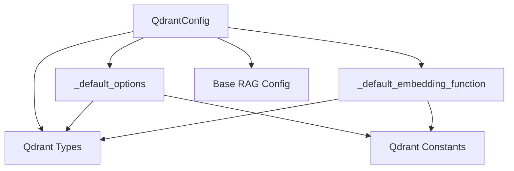

# Qdrant Configuration Module

## Introduction

The `qdrant_configuration` module is responsible for defining the default configuration and settings for interacting with the Qdrant vector database within the CrewAI framework. It provides a structured way to manage Qdrant client parameters and embedding functions, ensuring consistent and efficient data retrieval for RAG (Retrieval Augmented Generation) operations.

## Architecture and Component Relationships

This module primarily defines the `QdrantConfig` dataclass, which encapsulates all necessary configurations for a Qdrant client. It leverages internal helper functions to provide default values for client options and embedding functions, and depends on other modules for specific type definitions and constant values.

<!-- DIAGRAM_JSON
{
    "direction": "TD",
    "nodes": [
        {"id": "qdrant_config", "label": "QdrantConfig", "type": "component", "link": null},
        {"id": "default_options", "label": "_default_options", "type": "component", "link": null},
        {"id": "default_embedding_function", "label": "_default_embedding_function", "type": "component", "link": null},
        {"id": "qdrant_types", "label": "Qdrant Types", "type": "external", "link": "qdrant_types.md"},
        {"id": "qdrant_constants", "label": "Qdrant Constants", "type": "external", "link": "qdrant_constants.md"},
        {"id": "base_rag_config", "label": "Base RAG Config", "type": "external", "link": "base_rag_config.md"}
    ],
    "edges": [
        {"source": "qdrant_config", "target": "default_options"},
        {"source": "qdrant_config", "target": "default_embedding_function"},
        {"source": "qdrant_config", "target": "qdrant_types"},
        {"source": "qdrant_config", "target": "base_rag_config"},
        {"source": "default_options", "target": "qdrant_types"},
        {"source": "default_options", "target": "qdrant_constants"},
        {"source": "default_embedding_function", "target": "qdrant_types"},
        {"source": "default_embedding_function", "target": "qdrant_constants"}
    ],
    "groups": []
}
-->



## Core Functionality

### `_default_options()`

This function creates and returns default Qdrant client initialization parameters, encapsulated in a `QdrantClientParams` object. By default, it configures a file-based storage path for the Qdrant client, using `DEFAULT_STORAGE_PATH` from the [qdrant_constants](qdrant_constants.md) module.

```python
def _default_options() -> QdrantClientParams:
    """Create default Qdrant client options.

    Returns:
        Default options with file-based storage.
    """
    return QdrantClientParams(path=DEFAULT_STORAGE_PATH)
```

### `_default_embedding_function()`

This function provides a default embedding function using `fastembed` with the `all-MiniLM-L6-v2` model. This function is responsible for converting text into vector embeddings, which are crucial for vector similarity search in Qdrant. It is imported as a `QdrantEmbeddingFunctionWrapper` type from the [qdrant_types](qdrant_types.md) module.

### `QdrantConfig`

The `QdrantConfig` dataclass is the central configuration object for Qdrant. It inherits from [base_rag_config](base_rag_config.md) and defines the following fields:

*   `provider`: A literal `"qdrant"` indicating the vector database provider.
*   `options`: `QdrantClientParams` obtained from `_default_options()`.
*   `embedding_function`: The embedding function obtained from `_default_embedding_function()`.
*   `vectors_config`: Optional `VectorParams` for configuring vector storage in Qdrant.

## How it Fits into the Overall System

The `qdrant_configuration` module is a vital part of the `crewai_rag_system`, specifically within the `qdrant_integration`. It provides the foundational configuration for setting up and interacting with Qdrant as a vector database for Retrieval Augmented Generation (RAG). 

Other modules, such as [qdrant_vector_search](qdrant_vector_search.md) within `crewai_tools_vector_database`, would utilize the `QdrantConfig` to initialize their Qdrant clients and perform vector search operations. By centralizing the configuration here, the system ensures consistency and simplifies the management of Qdrant-related settings across different components.
