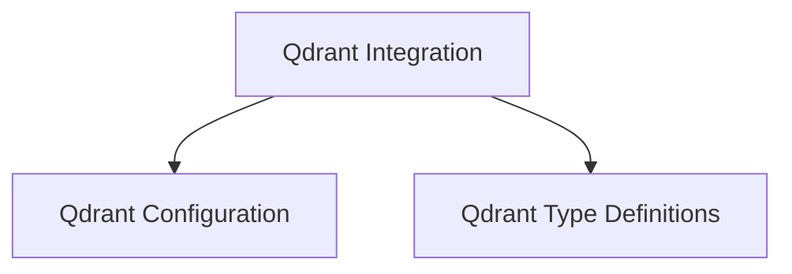

# Qdrant Integration Module

The `qdrant_integration` module provides the necessary components to interact with Qdrant, a vector similarity search engine. It facilitates the configuration of Qdrant clients, defines data types for embedding functions, and structures parameters for collection creation, enabling seamless integration of Qdrant's vector database capabilities within the larger system.

## Architecture Overview

The `qdrant_integration` module is structured into two main sub-modules: `qdrant_configuration` and `qdrant_types`. These modules encapsulate specific functionalities related to Qdrant client setup and data modeling.

<!-- DIAGRAM_JSON
{
    "direction": "TD",
    "nodes": [
        {"id": "qdrant_integration", "label": "Qdrant Integration", "type": "module"},
        {"id": "qdrant_configuration", "label": "Qdrant Configuration", "type": "module", "link": "qdrant_configuration.md"},
        {"id": "qdrant_types", "label": "Qdrant Type Definitions", "type": "module", "link": "qdrant_types.md"}
    ],
    "edges": [
        {"source": "qdrant_integration", "target": "qdrant_configuration"},
        {"source": "qdrant_integration", "target": "qdrant_types"}
    ],
    "groups": []
}
-->

## Sub-modules

### [Qdrant Configuration](qdrant_configuration.md)
This sub-module focuses on establishing the default settings and parameters required to initialize and connect to a Qdrant client. It includes functions for setting up client options, such as specifying storage paths.

### [Qdrant Type Definitions](qdrant_types.md)
This sub-module defines the essential data structures and classes used for interacting with the Qdrant API. It includes wrappers for embedding functions and Pydantic models for defining parameters when creating or updating Qdrant collections. This ensures type safety and simplifies data validation for Qdrant operations.