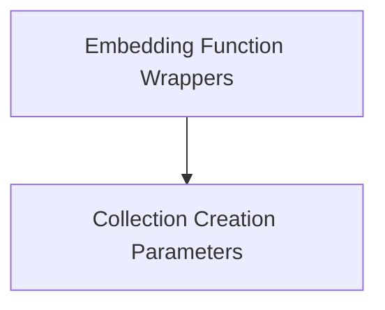

# Qdrant Types Module

The `qdrant_types` module defines the data structures and utility wrappers essential for interacting with Qdrant vector databases within the CrewAI RAG system. It provides high-level abstractions for defining embedding functions and parameters for creating and managing Qdrant collections, ensuring seamless integration and configuration.

## Architecture Overview

This module is structured into two main sub-modules, focusing on distinct aspects of Qdrant integration:

- **Embedding Function Wrappers**: Handles the adaptation of Qdrant's embedding functions for Pydantic compatibility.
- **Collection Creation Parameters**: Defines the necessary parameters for setting up and configuring Qdrant collections.

Each sub-module is designed to encapsulate specific functionalities, promoting modularity and maintainability within the larger CrewAI RAG framework.

<!-- DIAGRAM_JSON
{
    "direction": "TD",
    "nodes": [
        {"id": "embedding_wrappers", "label": "Embedding Function Wrappers", "type": "module", "link": "embedding_wrappers.md"},
        {"id": "collection_parameters", "label": "Collection Creation Parameters", "type": "module", "link": "collection_parameters.md"}
    ],
    "edges": [
        {"source": "embedding_wrappers", "target": "collection_parameters"}
    ],
    "groups": []
}
-->

