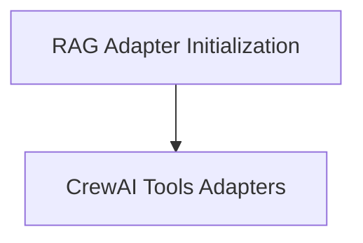

# RAG Adapter Initialization

The `rag_adapter_initialization` module is responsible for the dynamic instantiation and management of RAG (Retrieval Augmented Generation) adapters within the CrewAI ecosystem. It ensures that the appropriate RAG adapter, specifically `CrewAIRagAdapter`, is initialized and configured based on the provided settings, or provides a placeholder interface if an adapter is not yet concretely defined.

## Architecture Overview

This module primarily interacts with the `crewai_tools_adapters` module to obtain concrete RAG adapter implementations. It serves as a crucial bridge, allowing the `rag_tool_internals` to dynamically set up the RAG capabilities.

<!-- DIAGRAM_JSON
{
    "direction": "TD",
    "nodes": [
        {"id": "rag_adapter_initialization", "label": "RAG Adapter Initialization", "type": "module", "link": "rag_adapter_initialization.md"},
        {"id": "crewai_tools_adapters", "label": "CrewAI Tools Adapters", "type": "external", "link": "crewai_tools_adapters.md"}
    ],
    "edges": [
        {"source": "rag_adapter_initialization", "target": "crewai_tools_adapters"}
    ],
    "groups": []
}
-->

## Module Functionality

### `_ensure_adapter`
This internal function dynamically initializes the RAG adapter if a placeholder is currently in use. It instantiates `CrewAIRagAdapter` with the configured collection name, summarization settings, similarity threshold, limit, and other provider-specific configurations.

### `_AdapterPlaceholder`
This class acts as an abstract base for RAG adapters, defining the `query` and `add` methods that concrete adapter implementations must provide. It ensures a consistent interface for RAG operations, even when a specific adapter has not yet been fully initialized. Attempting to call these methods on a `_AdapterPlaceholder` directly will result in a `NotImplementedError`.