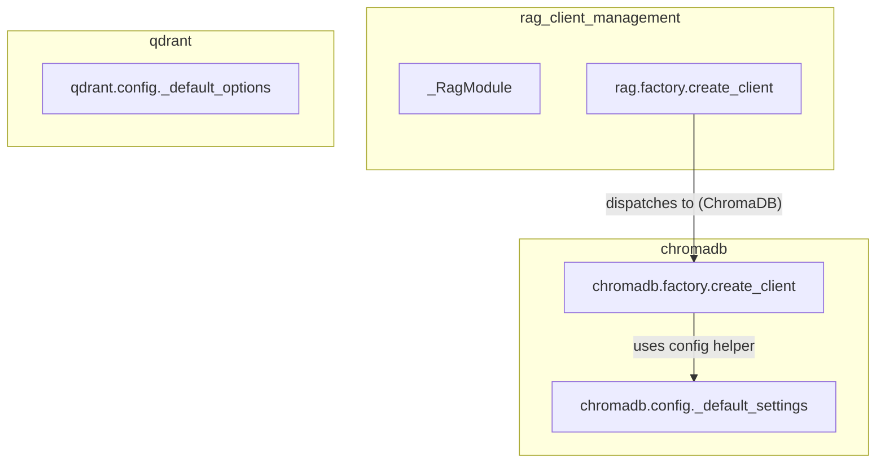

# rag_client_management
This module provides a flexible system for managing Retrieval-Augmented Generation (RAG) clients, featuring a central factory for creating clients based on configuration and specialized factories for providers like ChromaDB.

<!-- DIAGRAM_JSON
{
  "nodes": [
    {"id": "_RagModule", "label": "_RagModule"},
    {"id": "rag_factory_create_client", "label": "rag.factory.create_client"},
    {"id": "chromadb_factory_create_client", "label": "chromadb.factory.create_client"},
    {"id": "chromadb_config_default_settings", "label": "chromadb.config._default_settings"},
    {"id": "qdrant_config_default_options", "label": "qdrant.config._default_options"}
  ],
  "edges": [
    {"source": "rag_factory_create_client", "target": "chromadb_factory_create_client", "label": "dispatches to (ChromaDB)"},
    {"source": "chromadb_factory_create_client", "target": "chromadb_config_default_settings", "label": "uses config helper"}
  ],
  "groups": [
    {"id": "rag_client_management", "label": "rag_client_management", "nodes": ["_RagModule", "rag_factory_create_client"]},
    {"id": "chromadb", "label": "chromadb", "nodes": ["chromadb_factory_create_client", "chromadb_config_default_settings"]},
    {"id": "qdrant", "label": "qdrant", "nodes": ["qdrant_config_default_options"]}
  ]
}
-->
