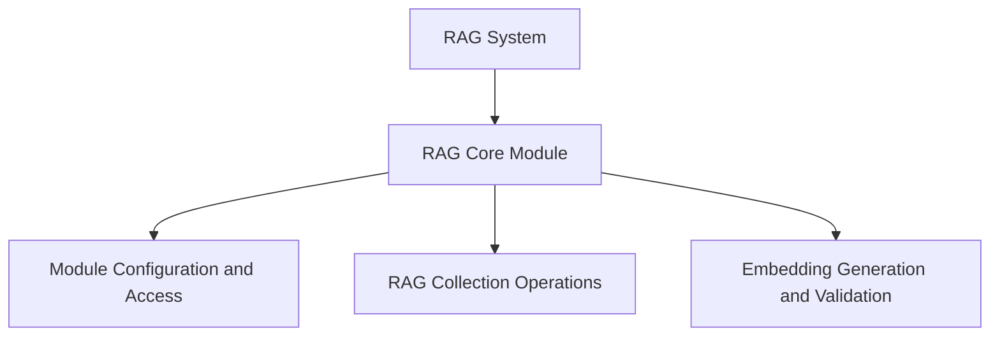

# RAG Core Module Documentation

The `rag_core` module serves as the foundational component for Retrieval Augmented Generation (RAG) capabilities within the CrewAI framework. It provides the core interfaces and utilities necessary for managing RAG configurations, handling collection interactions (adding and searching documents), and defining embedding generation processes.

This module is crucial for integrating external knowledge sources and enabling agents to retrieve relevant information efficiently during task execution.

## Architecture Overview

The `rag_core` module is structured into several key sub-modules, each responsible for a specific aspect of the RAG workflow. The diagram below illustrates the relationships between these components:

<!-- DIAGRAM_JSON
{
    "direction": "TD",
    "nodes": [
        {"id": "crewai_rag_system", "label": "RAG System", "type": "module", "link": "crewai_rag_system.md"},
        {"id": "rag_core", "label": "RAG Core Module", "type": "module", "link": "rag_core.md"},
        {"id": "module_management", "label": "Module Configuration and Access", "type": "module", "link": "module_management.md"},
        {"id": "collection_operations", "label": "RAG Collection Operations", "type": "module", "link": "collection_operations.md"},
        {"id": "embedding_handling", "label": "Embedding Generation and Validation", "type": "module", "link": "embedding_handling.md"}
    ],
    "edges": [
        {"source": "crewai_rag_system", "target": "rag_core"},
        {"source": "rag_core", "target": "module_management"},
        {"source": "rag_core", "target": "collection_operations"},
        {"source": "rag_core", "target": "embedding_handling"}
    ],
    "groups": []
}
-->

## Sub-modules

### [Module Configuration and Access](module_management.md)
This sub-module is responsible for managing the dynamic configuration and attribute access for the RAG module. It allows for flexible integration of RAG components by intercepting attribute setting for configuration and dynamically importing sub-modules.

### [RAG Collection Operations](collection_operations.md)
This sub-module defines the base parameters for adding and searching documents within RAG collections. It provides standardized interfaces for interacting with underlying RAG collection clients, ensuring consistent data handling for adding new documents and performing efficient searches.

### [Embedding Generation and Validation](embedding_handling.md)
This sub-module provides a protocol for creating and validating vector embeddings from various data inputs. It ensures that embedding functions adhere to a consistent interface, including normalization and validation of the generated embeddings, which is crucial for accurate RAG functionality.
