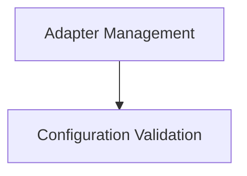

# RAG Tool Internals Documentation

This document provides an in-depth look into the internal workings of the `rag_tool_internals` module. This module is crucial for integrating Retrieval-Augmented Generation (RAG) capabilities within the CrewAI tools ecosystem, facilitating efficient document querying and management.

## Architecture Overview

The `rag_tool_internals` module is designed with a clear separation of concerns, focusing on adapter management and configuration validation. The core functionality revolves around dynamically loading and ensuring the correct RAG adapter is in place, while also robustly validating any provided configurations.

<!-- DIAGRAM_JSON
{
    "direction": "TD",
    "nodes": [
        {"id": "adapter_management", "label": "Adapter Management", "type": "module", "link": "adapter_management.md"},
        {"id": "configuration_validation", "label": "Configuration Validation", "type": "module", "link": "configuration_validation.md"}
    ],
    "edges": [
        {"source": "adapter_management", "target": "configuration_validation"}
    ],
    "groups": []
}
-->

## Sub-modules

### [Adapter Management](adapter_management.md)
This sub-module is responsible for ensuring that the correct RAG adapter is loaded and initialized. It handles the transition from a placeholder adapter to a fully functional `CrewAIRagAdapter` based on the provided configuration.

### [Configuration Validation](configuration_validation.md)
This sub-module focuses on validating the configuration settings for the RAG tool, especially concerning the embedding models. It provides improved error messages for easier debugging and ensures that only valid configurations are used.