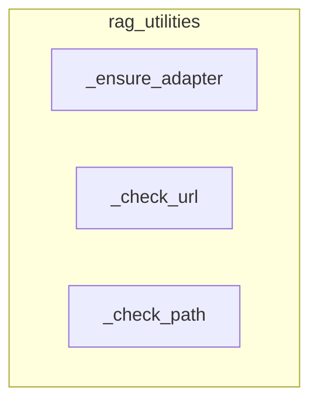

# rag_utilities
This module provides utility functions for RAG (Retrieval Augmented Generation) tools, handling adapter initialization and validating URLs and file paths for secure operation.

<!-- DIAGRAM_JSON
{
  "nodes": [
    {"id": "_ensure_adapter", "label": "_ensure_adapter"},
    {"id": "_check_url", "label": "_check_url"},
    {"id": "_check_path", "label": "_check_path"}
  ],
  "edges": [],
  "groups": [
    {"id": "rag_utilities", "label": "rag_utilities", "nodes": ["_ensure_adapter", "_check_url", "_check_path"]}
  ]
}
-->
