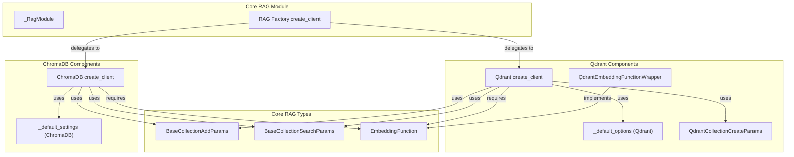

# rag_vector_stores
This module provides core components for Retrieval Augmented Generation (RAG) vector store interactions, including a factory for creating clients like ChromaDB and Qdrant, along with base types for collection operations and embedding functions.

<!-- DIAGRAM_JSON
{
    "nodes": [
        {
            "id": "rag_vector_stores",
            "label": "rag_vector_stores",
            "type": "module"
        },
        {
            "id": "A",
            "label": "_RagModule"
        },
        {
            "id": "B",
            "label": "_default_settings (ChromaDB)"
        },
        {
            "id": "C",
            "label": "ChromaDB create_client"
        },
        {
            "id": "D",
            "label": "BaseCollectionAddParams"
        },
        {
            "id": "E",
            "label": "BaseCollectionSearchParams"
        },
        {
            "id": "F",
            "label": "EmbeddingFunction"
        },
        {
            "id": "G",
            "label": "RAG Factory create_client"
        },
        {
            "id": "H",
            "label": "_default_options (Qdrant)"
        },
        {
            "id": "I",
            "label": "QdrantEmbeddingFunctionWrapper"
        },
        {
            "id": "J",
            "label": "QdrantCollectionCreateParams"
        },
        {
            "id": "K",
            "label": "Qdrant create_client"
        },
        {
            "id": "rag_client_management",
            "label": "RAG Client Management",
            "type": "module",
            "link": "rag_client_management.md"
        },
        {
            "id": "collection_and_embeddings",
            "label": "Collection and Embeddings",
            "type": "module",
            "link": "collection_and_embeddings.md"
        }
    ],
    "edges": [
        {
            "source": "G",
            "target": "C",
            "label": "delegates to"
        },
        {
            "source": "G",
            "target": "K",
            "label": "delegates to"
        },
        {
            "source": "C",
            "target": "B",
            "label": "uses"
        },
        {
            "source": "K",
            "target": "H",
            "label": "uses"
        },
        {
            "source": "I",
            "target": "F",
            "label": "implements"
        },
        {
            "source": "C",
            "target": "F",
            "label": "requires"
        },
        {
            "source": "K",
            "target": "F",
            "label": "requires"
        },
        {
            "source": "C",
            "target": "D",
            "label": "uses"
        },
        {
            "source": "C",
            "target": "E",
            "label": "uses"
        },
        {
            "source": "K",
            "target": "D",
            "label": "uses"
        },
        {
            "source": "K",
            "target": "E",
            "label": "uses"
        },
        {
            "source": "K",
            "target": "J",
            "label": "uses"
        },
        {
            "source": "rag_vector_stores",
            "target": "rag_client_management"
        },
        {
            "source": "rag_vector_stores",
            "target": "collection_and_embeddings"
        }
    ],
    "groups": [
        {
            "id": "core_rag_module",
            "label": "Core RAG Module",
            "nodes": [
                "A",
                "G"
            ]
        },
        {
            "id": "core_rag_types",
            "label": "Core RAG Types",
            "nodes": [
                "D",
                "E",
                "F"
            ]
        },
        {
            "id": "chromadb_components",
            "label": "ChromaDB Components",
            "nodes": [
                "B",
                "C"
            ]
        },
        {
            "id": "qdrant_components",
            "label": "Qdrant Components",
            "nodes": [
                "H",
                "I",
                "J",
                "K"
            ]
        }
    ]
}
-->
