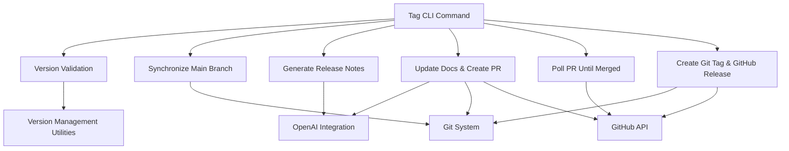

# release_tagging Module Documentation

## Introduction
The `release_tagging` module is a crucial part of the `crewai_devtools_cli` responsible for automating the creation and pushing of version tags and GitHub releases. It ensures that after a version bump, the repository is correctly tagged, and release notes are generated and updated, including necessary documentation changes.

## Architecture and Component Relationships

The `release_tagging` module primarily exposes the `tag` CLI command, which orchestrates a series of steps to manage the release process.

**Core Functionality Flow:**
1.  **Version Validation:** The process begins by scanning the `lib` directory for all packages and validating that all `__version__` strings across these packages are consistent.
2.  **Git Synchronization:** If not in dry-run mode, it ensures the local `main` branch is checked out and up-to-date with the remote.
3.  **Release Notes Generation:** It generates comprehensive release notes for the new version, potentially leveraging AI assistance (e.g., via an OpenAI client).
4.  **Documentation Update and Pull Request:** It updates relevant documentation based on the new release and creates a pull request for these changes.
5.  **PR Monitoring:** The process then polls GitHub to ensure the documentation PR is merged before proceeding.
6.  **Tag and Release Creation:** Finally, it creates a Git tag and a corresponding GitHub release with the generated release notes.

<!-- DIAGRAM_JSON
{
    "direction": "TD",
    "nodes": [
        {"id": "tag_cli_command", "label": "Tag CLI Command", "type": "component", "link": null},
        {"id": "validate_versions", "label": "Version Validation", "type": "component", "link": null},
        {"id": "sync_main_branch", "label": "Synchronize Main Branch", "type": "component", "link": null},
        {"id": "generate_release_notes", "label": "Generate Release Notes", "type": "component", "link": null},
        {"id": "update_docs_create_pr", "label": "Update Docs & Create PR", "type": "component", "link": null},
        {"id": "poll_pr_merge", "label": "Poll PR Until Merged", "type": "component", "link": null},
        {"id": "create_git_tag_github_release", "label": "Create Git Tag & GitHub Release", "type": "component", "link": null},
        {"id": "version_management_utils", "label": "Version Management Utilities", "type": "external", "link": "version_management.md"},
        {"id": "git_system", "label": "Git System", "type": "external", "link": null},
        {"id": "github_api", "label": "GitHub API", "type": "external", "link": null},
        {"id": "openai_integration", "label": "OpenAI Integration", "type": "external", "link": "crewai_llm_integrations.md"}
    ],
    "edges": [
        {"source": "tag_cli_command", "target": "validate_versions"},
        {"source": "tag_cli_command", "target": "sync_main_branch"},
        {"source": "tag_cli_command", "target": "generate_release_notes"},
        {"source": "tag_cli_command", "target": "update_docs_create_pr"},
        {"source": "tag_cli_command", "target": "poll_pr_merge"},
        {"source": "tag_cli_command", "target": "create_git_tag_github_release"},
        {"source": "validate_versions", "target": "version_management_utils"},
        {"source": "sync_main_branch", "target": "git_system"},
        {"source": "generate_release_notes", "target": "openai_integration"},
        {"source": "update_docs_create_pr", "target": "openai_integration"},
        {"source": "update_docs_create_pr", "target": "git_system"},
        {"source": "update_docs_create_pr", "target": "github_api"},
        {"source": "poll_pr_merge", "target": "github_api"},
        {"source": "create_git_tag_github_release", "target": "git_system"},
        {"source": "create_git_tag_github_release", "target": "github_api"}
    ],
    "groups": []
}
-->

## How the Module Fits into the Overall System
The `release_tagging` module is an integral part of the `crewai_devtools_cli` system, specifically residing under the `version_management` sub-module. It provides the automation necessary to streamline the post-version bump activities, ensuring that every new release is properly recorded and documented.

It acts as a bridge between the development workflow (version bumping, code merges) and the release workflow (tagging, GitHub releases, documentation updates). By automating these steps, it reduces manual errors and ensures consistency across releases.

This module depends on:
*   **`version_management`**: For helper functions like `get_packages` and `find_version_files` which are essential for discovering and validating package versions.
*   **`crewai_llm_integrations`**: Specifically, it relies on an OpenAI client (indirectly through internal helper functions `_generate_release_notes` and `_update_docs_and_create_pr`) to assist in generating intelligent release notes and potentially automating documentation updates.
*   **External Systems**: It heavily interacts with Git for repository operations and the GitHub API for creating releases and managing pull requests.

The `release_tagging` module is designed to be executed after a version bump PR has been merged into the `main` branch, ensuring that the tagged version correctly reflects the state of the codebase. It explicitly notes that it *does not* handle version bumping, PyPI publishing, or enterprise releases, directing users to the more comprehensive `devtools release` command for full end-to-end releases.