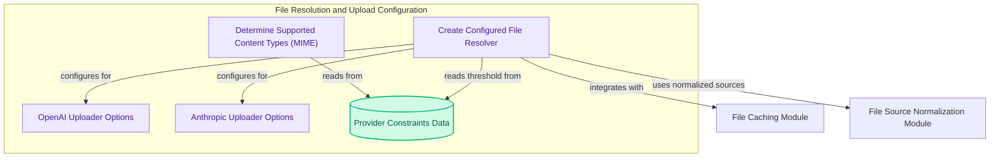

# File Resolution and Upload Configuration
This module manages the configuration aspects for file resolution and upload, including determining supported content types for various providers and creating file resolvers tailored with specific upload options and caching settings.

<!-- DIAGRAM_JSON
{
    "direction": "TD",
    "nodes": [
        {"id": "get_types", "label": "Determine Supported Content Types (MIME)", "type": "component", "link": null},
        {"id": "create_res", "label": "Create Configured File Resolver", "type": "component", "link": null},
        {"id": "openai_opts", "label": "OpenAI Uploader Options", "type": "component", "link": null},
        {"id": "anthropic_opts", "label": "Anthropic Uploader Options", "type": "component", "link": null},
        {"id": "provider_constraints", "label": "Provider Constraints Data", "type": "component", "link": null},
        {"id": "file_cache", "label": "File Caching Module", "type": "external", "link": "file_caching.md"},
        {"id": "file_src_norm", "label": "File Source Normalization Module", "type": "external", "link": "file_source_normalization.md"}
    ],
    "edges": [
        {"source": "get_types", "target": "provider_constraints", "label": "reads from"},
        {"source": "create_res", "target": "provider_constraints", "label": "reads threshold from"},
        {"source": "create_res", "target": "file_cache", "label": "integrates with"},
        {"source": "create_res", "target": "file_src_norm", "label": "uses normalized sources"},
        {"source": "create_res", "target": "openai_opts", "label": "configures for"},
        {"source": "create_res", "target": "anthropic_opts", "label": "configures for"}
    ],
    "groups": [
        {"id": "config_flow", "label": "File Resolution & Upload Configuration", "role": "analytical", "nodes": ["get_types", "create_res", "openai_opts", "anthropic_opts", "provider_constraints"]}
    ]
}
-->
