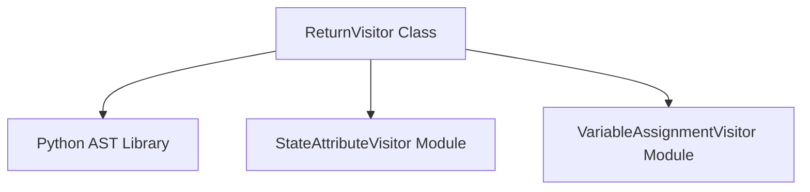

# return_visitor_module

## Introduction
The `return_visitor_module` provides the `ReturnVisitor` class, an Abstract Syntax Tree (AST) visitor designed to identify and extract possible return values from Python code, particularly within the context of CrewAI's flow management. It plays a crucial role in static analysis by determining what values a function or method might return.

## Purpose and Core Functionality
The primary purpose of this module is to statically analyze Python code to infer return values. This is essential for understanding the data flow within CrewAI agents and tasks, enabling better validation, optimization, and debugging of complex workflows.

The `ReturnVisitor` class, inheriting from Python's `ast.NodeVisitor`, implements the following key methods:

### `visit_Return(self, node: ast.Return) -> None`
This method is invoked when the AST traversal encounters a `return` statement. It intelligently extracts the value being returned by handling several scenarios:
*   **Constant String Returns:** If the return value is a direct string literal (e.g., `return "success"`), it's added to a collection of `return_values`.
*   **Dictionary Subscript Returns:** If the return value is a dictionary lookup (e.g., `return my_dict['key']`), it attempts to resolve the possible values based on `dict_definitions` (a dictionary mapping variable names to their possible values).
*   **Variable or State Attribute Returns:** For other return expressions, it attempts to resolve the variable's value using `get_attribute_chain` to determine the variable's name and then consulting `variable_values` or `state_attribute_values` collections. These collections likely hold information about local variables and agent state attributes collected by other AST visitors.

### `visit_If(self, node: ast.If) -> None`
This method simply calls `self.generic_visit(node)`, ensuring that the visitor continues to traverse into `if` and `else` blocks. This allows the `visit_Return` method to catch return statements that might be conditionally executed.

## Architecture and Component Relationships
The `return_visitor_module` is a specialized component within the `crewai_flow_management.flow_utils.ast_visitors` sub-package. It works collaboratively with other AST visitors to build a comprehensive understanding of the code's structure and behavior.

<!-- DIAGRAM_JSON
{
    "direction": "TD",
    "nodes": [
        {"id": "return_visitor", "label": "ReturnVisitor Class", "type": "component", "link": null},
        {"id": "ast_lib", "label": "Python AST Library", "type": "external", "link": null},
        {"id": "state_attr_visitor", "label": "StateAttributeVisitor Module", "type": "external", "link": "state_attribute_visitor_module.md"},
        {"id": "var_assign_visitor", "label": "VariableAssignmentVisitor Module", "type": "external", "link": "variable_assignment_visitor_module.md"}
    ],
    "edges": [
        {"source": "return_visitor", "target": "ast_lib"},
        {"source": "return_visitor", "target": "state_attr_visitor"},
        {"source": "return_visitor", "target": "var_assign_visitor"}
    ],
    "groups": []
}
-->

**Key Relationships:**
*   **`ReturnVisitor` and `Python AST Library`**: The core dependency is on Python's built-in `ast` module, which provides the framework for parsing code into an AST and traversing it.
*   **`ReturnVisitor` and Sibling Visitors**: `ReturnVisitor` often operates in an environment where information gathered by `StateAttributeVisitor` (see [state_attribute_visitor_module.md](state_attribute_visitor_module.md)) and `VariableAssignmentVisitor` (see [variable_assignment_visitor_module.md](variable_assignment_visitor_module.md)) is available. These visitors collectively contribute to a richer understanding of the code's execution context.

## How the Module Fits into the Overall System
The `return_visitor_module` is an integral part of the CrewAI `flow_management` system, specifically within the `flow_utils` for AST analysis. Its ability to determine potential return values from agent actions or task executions is critical for:
*   **Flow Validation:** Ensuring that agents return expected types or values for subsequent tasks.
*   **Static Analysis:** Providing insights into the potential outcomes of a flow without actual execution.
*   **Debugging and Diagnostics:** Helping developers understand why a flow might be behaving unexpectedly by identifying what values are being returned at different points.
*   **Optimized Flow Execution:** Potentially informing decisions about how to route or process tasks based on anticipated return values.

By providing a mechanism to inspect return statements, this module contributes to making CrewAI flows more robust, predictable, and easier to manage.