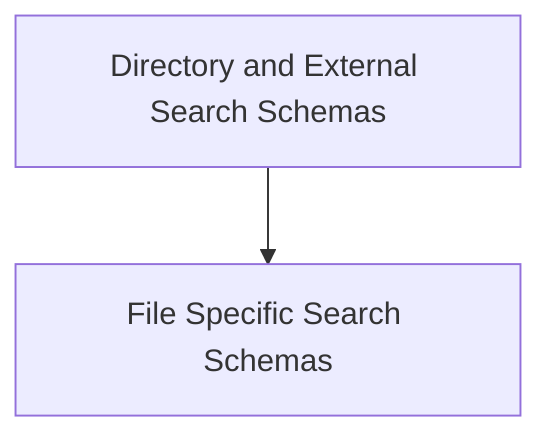

# Schema Definitions Module

The `schema_definitions` module plays a crucial role in the CrewAI Tools ecosystem by providing standardized input schemas for various search and read tools. These schemas, built using Pydantic, ensure that the tools receive valid and expected input, promoting robustness and ease of integration.

## Architecture Overview

This module is structured into sub-modules, each defining schemas for a specific category of tools. This organization enhances clarity and maintainability, allowing developers to quickly locate and understand the input requirements for different functionalities.

<!-- DIAGRAM_JSON
{
    "direction": "TD",
    "nodes": [
        {"id": "directory_and_external_search_schemas", "label": "Directory and External Search Schemas", "type": "module", "link": "directory_and_external_search_schemas.md"},
        {"id": "file_search_schemas", "label": "File Specific Search Schemas", "type": "module", "link": "file_search_schemas.md"}
    ],
    "edges": [
        {"source": "directory_and_external_search_schemas", "target": "file_search_schemas"}
    ],
    "groups": []
}
-->

## Sub-modules

- ### [Directory and External Search Schemas](directory_and_external_search_schemas.md)
  This sub-module defines input schemas for tools that perform searches or read operations on directories and external platforms like GitHub. It includes schemas such as `DirectoryReadToolSchema`, `DirectorySearchToolSchema`, and `GithubSearchToolSchema`.

- ### [File Specific Search Schemas](file_search_schemas.md)
  This sub-module defines input schemas for tools that search within specific file formats. It encompasses schemas for various file types, including `CSVSearchToolSchema`, `DOCXSearchToolSchema`, `JSONSearchToolSchema`, `MDXSearchToolSchema`, and `PDFSearchToolSchema`.
