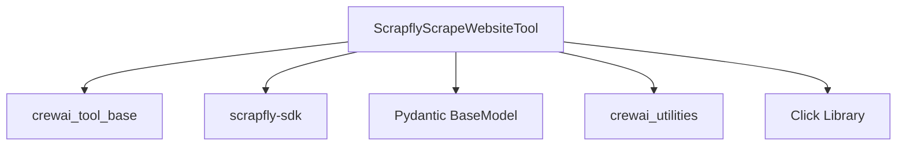

# `scrapfly_integration` Module Documentation

## Introduction

The `scrapfly_integration` module provides the `ScrapflyScrapeWebsiteTool`, an essential component for integrating web scraping capabilities using the Scrapfly API within the CrewAI framework. This module enables agents to programmatically extract content from webpages, supporting various formats like markdown or plain text.

## Purpose and Core Functionality

The primary purpose of this module is to offer a robust and reliable way to scrape website data. The `ScrapflyScrapeWebsiteTool` abstracts the complexities of the Scrapfly API, allowing agents to perform web scraping with minimal configuration. It handles API key management, dynamic installation of the `scrapfly-sdk` if missing, and provides a structured way to configure scraping requests.

### Core Component: `ScrapflyScrapeWebsiteTool`

-   **Description**: This tool facilitates scraping a given URL using the Scrapfly service. It can retrieve the webpage's content and return it in either markdown or plain text format.
-   **API Key Management**: It expects the Scrapfly API key to be provided during initialization or through the `SCRAPFLY_API_KEY` environment variable.
-   **Dependency Handling**: The tool includes logic to automatically prompt for and install the `scrapfly-sdk` if it's not already present in the environment, enhancing usability.
-   **Scraping Configuration**: Users can pass additional `scrape_config` parameters to customize the scraping process, leveraging the full power of the Scrapfly API.
-   **Error Handling**: It provides an option to ignore scraping failures, allowing for more resilient agent workflows.

## Architecture and Component Relationships

The `scrapfly_integration` module primarily revolves around the `ScrapflyScrapeWebsiteTool` class. This class inherits from `BaseTool`, making it a standard tool within the CrewAI ecosystem. It leverages the external `scrapfly-sdk` for its core web scraping functionality.

It also interacts with other CrewAI utility modules for dependency management (`EnvVar`) and schema definition (`BaseModel` from Pydantic).

<!-- DIAGRAM_JSON
{
    "direction": "TD",
    "nodes": [
        {"id": "scrapfly_scrape_website_tool", "label": "ScrapflyScrapeWebsiteTool", "type": "component", "link": null},
        {"id": "crewai_tool_base", "label": "crewai_tool_base", "type": "external", "link": "crewai_tool_base.md"},
        {"id": "scrapfly_sdk", "label": "scrapfly-sdk", "type": "external", "link": null},
        {"id": "pydantic", "label": "Pydantic BaseModel", "type": "external", "link": null},
        {"id": "crewai_utilities", "label": "crewai_utilities", "type": "external", "link": "crewai_utilities.md"},
        {"id": "click_library", "label": "Click Library", "type": "external", "link": null}
    ],
    "edges": [
        {"source": "scrapfly_scrape_website_tool", "target": "crewai_tool_base"},
        {"source": "scrapfly_scrape_website_tool", "target": "scrapfly_sdk"},
        {"source": "scrapfly_scrape_website_tool", "target": "pydantic"},
        {"source": "scrapfly_scrape_website_tool", "target": "crewai_utilities"},
        {"source": "scrapfly_scrape_website_tool", "target": "click_library"}
    ],
    "groups": []
}
-->

## How the Module Fits into the Overall System

The `scrapfly_integration` module is a specialized tool provider within the larger [crewai_tools_web_scraping](crewai_tools_web_scraping.md) package. It extends the capabilities of CrewAI agents by offering a dedicated mechanism for advanced web scraping using Scrapfly. This allows agents to gather up-to-date information from websites, which is crucial for tasks requiring current data, content analysis, or monitoring. Its integration ensures that CrewAI agents have access to a powerful and flexible web scraping solution, complementing other data gathering and processing tools within the framework.