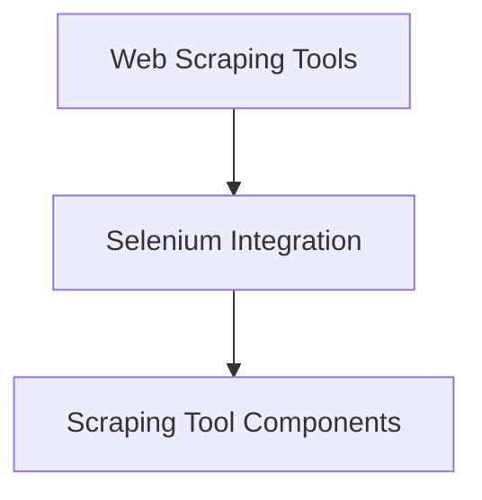

# `scraping_tool_components` Module Documentation

## Introduction
The `scraping_tool_components` module provides the core components for web scraping functionalities using Selenium within the CrewAI framework. It defines the SeleniumScrapingTool, which allows agents to programmatically interact with websites, read content, and extract specific elements, along with its associated schema for input validation.

## Architecture Overview
This module is a crucial part of the `crewai_tools_web_scraping` ecosystem, specifically integrated within the `selenium_integration` sub-module. It serves as the foundational layer for performing automated web interactions and data extraction using Selenium WebDriver.

<!-- DIAGRAM_JSON
{
    "direction": "TD",
    "nodes": [
        {"id": "crewai_tools_web_scraping", "label": "Web Scraping Tools", "type": "module", "link": "crewai_tools_web_scraping.md"},
        {"id": "selenium_integration", "label": "Selenium Integration", "type": "module", "link": "selenium_integration.md"},
        {"id": "scraping_tool_components", "label": "Scraping Tool Components", "type": "module", "link": "scraping_tool_components.md"}
    ],
    "edges": [
        {"source": "crewai_tools_web_scraping", "target": "selenium_integration"},
        {"source": "selenium_integration", "target": "scraping_tool_components"}
    ],
    "groups": []
}
-->

## Core Functionality

The `scraping_tool_components` module encapsulates the logic required for web scraping using the Selenium library. It provides a robust tool for agents to interact with dynamic web content.

### `SeleniumScrapingTool`
The `SeleniumScrapingTool` is a `BaseTool` that enables reading website content. It initializes a Selenium WebDriver (Chrome by default, running headless) and provides methods to navigate to URLs, handle cookies, wait for elements, and extract text or HTML from specified CSS elements. It automatically handles the installation of `selenium` and `webdriver-manager` if they are not found.

Key features:
-   **Configurable URL:** Can be initialized with a fixed URL or accept it dynamically during execution.
-   **CSS Element Targeting:** Allows specifying a CSS selector to scrape specific parts of a webpage.
-   **HTML vs. Text Output:** Can return either the plain text content or the raw HTML of the scraped elements.
-   **Cookie Handling:** Supports adding cookies to the browser session.
-   **Dependency Management:** Automatically prompts for and installs necessary Python packages (`selenium`, `webdriver-manager`).

### `SeleniumScrapingToolSchema`
The `SeleniumScrapingToolSchema` defines the input validation rules for the `SeleniumScrapingTool`. It ensures that the `website_url` and `css_element` arguments are provided in the correct format and meet specific criteria.

Key validations:
-   **Mandatory URL:** `website_url` is a required field.
-   **URL Format:** Ensures the URL starts with `http://` or `https://`, is not empty, does not exceed a maximum length, and has a valid format.
-   **Mandatory CSS Element:** `css_element` is a required field, ensuring that a target element is always specified for scraping.
