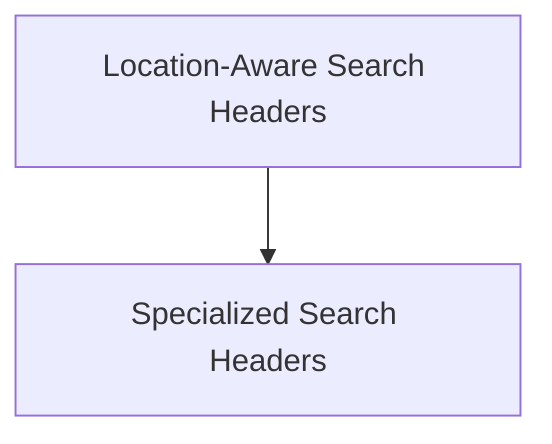

# search_api_schemas Module Documentation

## Introduction

The `search_api_schemas` module defines the Pydantic schemas for request headers used when interacting with the Brave Search API. These schemas are crucial for ensuring that search tools within the CrewAI ecosystem can construct valid and well-formed API requests, encompassing various search types and geographical contexts.

## Architecture Overview

The `search_api_schemas` module is organized into sub-modules based on the type of search headers they define, primarily distinguishing between headers that include location-specific information and those that are specialized for particular media types or descriptions.

<!-- DIAGRAM_JSON
{
    "direction": "TD",
    "nodes": [
        {"id": "location_search_headers", "label": "Location-Aware Search Headers", "type": "module", "link": "location_search_headers.md"},
        {"id": "specialized_search_headers", "label": "Specialized Search Headers", "type": "module", "link": "specialized_search_headers.md"}
    ],
    "edges": [
        {"source": "location_search_headers", "target": "specialized_search_headers"}
    ],
    "groups": []
}
-->

## Sub-modules

### [Location-Aware Search Headers](location_search_headers.md)
This sub-module defines Pydantic models for Brave Search API headers that include user location information for various search types like LLM context, local POIs, and web search. It ensures that geographical context can be accurately passed in search requests.

### [Specialized Search Headers](specialized_search_headers.md)
This sub-module contains Pydantic models for Brave Search API headers that are specific to certain search types, such as local POI descriptions, video, image, and news searches, without explicit location parameters. These schemas streamline requests for distinct content types.