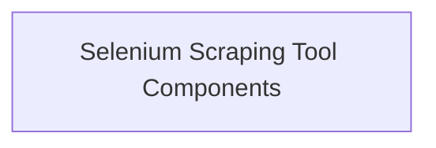

# Selenium Integration Module Documentation

## Introduction

The `selenium_integration` module provides tools for web content scraping using Selenium. It offers a robust `SeleniumScrapingTool` designed to extract information from websites, including dynamic content rendered by JavaScript.

## Architecture Overview

The `selenium_integration` module is structured around a core scraping tool and its associated schema, enabling efficient and configurable web data extraction. The architecture focuses on providing a flexible and reliable mechanism for interacting with web pages.

<!-- DIAGRAM_JSON
{
    "direction": "TD",
    "nodes": [
        {"id": "scraping_tool_components", "label": "Selenium Scraping Tool Components", "type": "module", "link": "scraping_tool_components.md"}
    ],
    "edges": [],
    "groups": []
}
-->

## Module Functionality

### [Selenium Scraping Tool Components](scraping_tool_components.md)
This sub-module contains the primary `SeleniumScrapingTool` and its `SeleniumScrapingToolSchema`. The tool facilitates advanced web scraping capabilities, allowing users to define target URLs, specific CSS elements, and handle website cookies for authenticated access. It leverages Selenium WebDriver to interact with web pages, supporting both plain text and HTML content extraction. The schema ensures proper validation of input parameters like `website_url` and `css_element`.
