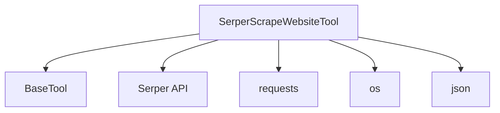

# Serper Integration Module

## Introduction

The `serper_integration` module provides a specialized tool for scraping website content using the Serper API. It simplifies the process of extracting clean, readable information from web pages, with an option to include markdown formatting for structured output. This module is a part of the `crewai-tools` library, specifically enhancing the web scraping capabilities within the CrewAI framework.

## Purpose and Core Functionality

The primary purpose of this module is to offer a robust and reliable way to scrape website content. The core component, `SerperScrapeWebsiteTool`, encapsulates the logic for interacting with the Serper API's scraping endpoint. Key functionalities include:

*   **Website Content Extraction:** Fetches the main textual content from any given URL.
*   **Markdown Formatting:** Optionally returns the scraped content formatted in Markdown, which can be highly beneficial for readability and further processing by LLMs.
*   **API Key Management:** Securely retrieves the Serper API key from environment variables, ensuring proper authentication with the Serper service.
*   **Error Handling:** Implements comprehensive error handling for network issues, API response parsing, and other unexpected problems, providing informative feedback.

## Architecture and Component Relationships

The `serper_integration` module revolves around the `SerperScrapeWebsiteTool` class. This tool inherits from `BaseTool` (see [crewai_tool_base.md](crewai_tool_base.md)), adhering to the standard interface for tools within the CrewAI ecosystem. It leverages external libraries for network requests and JSON processing.

### Core Component: `SerperScrapeWebsiteTool`

*   **`name`**: `serper_scrape_website` - A unique identifier for the tool.
*   **`description`**: Explains the tool's capability to scrape website content using Serper's API, including markdown formatting.
*   **`args_schema`**: Defines the expected input arguments for the tool, specifically `url` (the website to scrape) and `include_markdown` (a boolean to control markdown output).
*   **`env_vars`**: Specifies the mandatory `SERPER_API_KEY` environment variable required for authentication with the Serper API.
*   **`_run(self, url: str, include_markdown: bool = True) -> str`**: This is the core method that executes the scraping logic. It constructs the API request to `https://scrape.serper.dev`, sends the payload (URL and markdown preference) with the API key, and processes the response. It handles successful content extraction as well as various error scenarios.

<!-- DIAGRAM_JSON
{
    "direction": "TD",
    "nodes": [
        {"id": "serper_scrape_website_tool", "label": "SerperScrapeWebsiteTool", "type": "component", "link": null},
        {"id": "base_tool", "label": "BaseTool", "type": "external", "link": "crewai_tool_base.md"},
        {"id": "serper_api", "label": "Serper API", "type": "external", "link": null},
        {"id": "requests", "label": "requests", "type": "external", "link": null},
        {"id": "os", "label": "os", "type": "external", "link": null},
        {"id": "json", "label": "json", "type": "external", "link": null}
    ],
    "edges": [
        {"source": "serper_scrape_website_tool", "target": "base_tool"},
        {"source": "serper_scrape_website_tool", "target": "serper_api"},
        {"source": "serper_scrape_website_tool", "target": "requests"},
        {"source": "serper_scrape_website_tool", "target": "os"},
        {"source": "serper_scrape_website_tool", "target": "json"}
    ],
    "groups": []
}
-->

## How the Module Fits into the Overall System

The `serper_integration` module is a specific implementation within the broader `crewai_tools_web_scraping` category (see [crewai_tools_web_scraping.md](crewai_tools_web_scraping.md)). It contributes to the comprehensive set of tools available to agents within the CrewAI framework, enabling them to gather information directly from the internet. By leveraging the Serper API, it provides an efficient and high-quality solution for web content extraction, which is crucial for tasks requiring up-to-date or detailed information from websites.

This module enhances the agents' capabilities to perform research, data collection, and content analysis by providing a reliable way to access and process web data. Its integration as a `BaseTool` ensures seamless usability within any CrewAI agent or task that requires web scraping functionality.