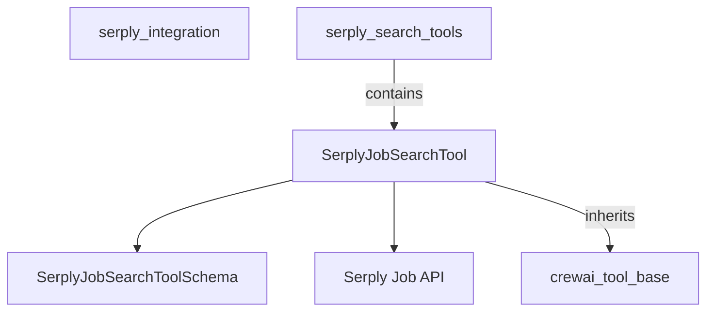

# serply_job_search Module Documentation

## Introduction
The `serply_job_search` module provides a specialized tool for performing job searches using the Serply API within the CrewAI framework. It is designed to allow agents to efficiently query job listings based on specified search criteria.

## Purpose and Core Functionality
The primary purpose of this module is to encapsulate the logic for interacting with the Serply Job Search API. Its core functionality revolves around the `SerplyJobSearchTool` class, which:
*   **Performs Job Searches**: Executes job queries against the Serply API, specifically targeting job listings in the US.
*   **Handles API Authentication**: Manages API key authentication for secure access to Serply services.
*   **Processes Search Results**: Parses the JSON response from the Serply API and formats it into a human-readable string, extracting key job details like position, employer, location, and highlights.
*   **Integrates with CrewAI**: Extends the `RagTool` base class, making it seamlessly integratable into CrewAI agent workflows as a Retrieval Augmented Generation (RAG) tool.

## Architecture and Component Relationships

<!-- DIAGRAM_JSON
{
    "direction": "TD",
    "nodes": [
        {"id": "serply_job_search_tool", "label": "SerplyJobSearchTool", "type": "component", "link": null},
        {"id": "serply_job_search_tool_schema", "label": "SerplyJobSearchToolSchema", "type": "component", "link": null},
        {"id": "serply_api", "label": "Serply Job API", "type": "external", "link": null},
        {"id": "crewai_tool_base", "label": "crewai_tool_base", "type": "external", "link": "crewai_tool_base.md"},
        {"id": "serply_integration", "label": "serply_integration", "type": "external", "link": "serply_integration.md"},
        {"id": "serply_search_tools", "label": "serply_search_tools", "type": "external", "link": "serply_search_tools.md"}
    ],
    "edges": [
        {"source": "serply_job_search_tool", "target": "serply_job_search_tool_schema"},
        {"source": "serply_job_search_tool", "target": "serply_api"},
        {"source": "serply_job_search_tool", "target": "crewai_tool_base"},
        {"source": "serply_search_tools", "target": "serply_job_search_tool"}
    ],
    "groups": []
}
-->

The `serply_job_search` module is a leaf module within the `crewai_tools_web_search` ecosystem, specifically residing under `serply_integration` and `serply_search_tools`. Its primary component is `SerplyJobSearchTool`.

### Key Components:

*   **`SerplyJobSearchTool`**: This is the central class of the module. It extends `RagTool` from `crewai_tool_base`, making it a specialized tool for RAG-based operations. It defines the `name`, `description`, `args_schema`, `request_url`, `proxy_location`, and required `env_vars`.
    *   **Initialization (`__init__`)**: Sets up the necessary HTTP headers, including the Serply API key (retrieved from environment variables) and a User-Agent. The `X-Proxy-Location` header is also set, currently defaulting to "US".
    *   **Execution (`_run`)**: This method handles the actual job search. It takes a `query` or `search_query` string, constructs the request URL, makes a GET request to the Serply API, and then processes the JSON response. It iterates through the retrieved jobs, extracting relevant information such as position, employer, location, link, highlights, and remote/hybrid status, formatting them into a readable string.
*   **`SerplyJobSearchToolSchema`**: (Implicit Component) This Pydantic `BaseModel` defines the expected input arguments for the `SerplyJobSearchTool`, ensuring proper validation and structure of search queries.

### Relationships:

*   `SerplyJobSearchTool` **inherits from** `RagTool` (from `crewai_tool_base`), gaining foundational tool capabilities.
*   `SerplyJobSearchTool` **uses** `SerplyJobSearchToolSchema` to define and validate its input arguments.
*   `SerplyJobSearchTool` **communicates with** the external Serply Job API to fetch job data.
*   The `serply_job_search` module is a **sub-module of** `serply_search_tools`, which in turn is part of the `serply_integration` module.

## How the Module Fits into the Overall System

The `serply_job_search` module is a crucial part of the `crewai_tools_web_search` suite, providing specialized web search capabilities focused on job listings.
*   **Enhances Agent Capabilities**: By offering a dedicated job search tool, it empowers CrewAI agents to perform targeted research on employment opportunities, recruitments, or labor market analysis.
*   **Part of Serply Integration**: It integrates seamlessly within the broader `serply_integration` framework, allowing access to Serply's diverse search capabilities alongside other specialized Serply tools like news or scholar search (see [serply_integration.md](serply_integration.md) and [serply_search_tools.md](serply_search_tools.md)).
*   **RAG System Integration**: As a `RagTool`, it can be utilized by RAG-enabled agents to retrieve up-to-date job information, which can then be used to augment agent reasoning and response generation.
*   **Modular and Extensible**: Its design as a distinct tool promotes modularity, allowing for easy updates or extensions to the job search functionality without impacting other parts of the CrewAI tools library.
