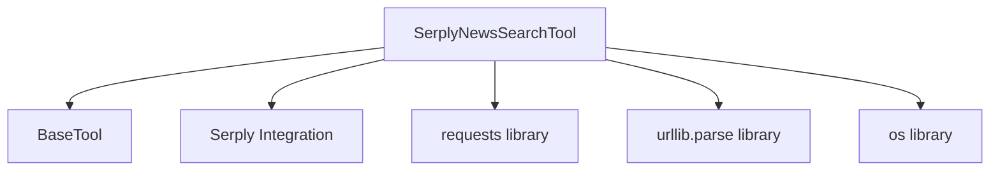

# serply_news_search Module Documentation

## Introduction
The `serply_news_search` module provides a specialized tool for performing news article searches using the Serply API. It is a key component within the `crewai_tools_web_search.serply_integration` sub-system, enabling agents to retrieve relevant news content based on specific queries and geographical preferences.

## Module Purpose and Core Functionality
The primary purpose of the `serply_news_search` module is to offer a robust and configurable interface for accessing news data through Serply.io. Its core functionality revolves around the `SerplyNewsSearchTool` class, which encapsulates the logic for:
- Constructing search requests to the Serply News API.
- Handling API key authentication and user-agent identification.
- Specifying search parameters such as query, result limit, and proxy location (country-specific news).
- Parsing API responses and formatting the news articles into a readable string, including title, link, source, and publication date.
- Following redirects to obtain the final link for news articles.

## Architecture and Component Relationships

The `serply_news_search` module is a leaf module, meaning it does not contain further sub-modules. It relies on external libraries for HTTP requests and URL encoding, and integrates with the broader CrewAI Tools ecosystem through its `BaseTool` inheritance. It is a part of the `serply_integration` module, which groups all Serply-related tools.

<!-- DIAGRAM_JSON
{
    "direction": "TD",
    "nodes": [
        {"id": "serply_news_search_tool", "label": "SerplyNewsSearchTool", "type": "component", "link": null},
        {"id": "base_tool", "label": "BaseTool", "type": "external", "link": "crewai_tool_base.md"},
        {"id": "serply_integration", "label": "Serply Integration", "type": "external", "link": "serply_integration.md"},
        {"id": "requests_lib", "label": "requests library", "type": "external", "link": null},
        {"id": "urllib_parse_lib", "label": "urllib.parse library", "type": "external", "link": null},
        {"id": "os_lib", "label": "os library", "type": "external", "link": null}
    ],
    "edges": [
        {"source": "serply_news_search_tool", "target": "base_tool"},
        {"source": "serply_news_search_tool", "target": "serply_integration"},
        {"source": "serply_news_search_tool", "target": "requests_lib"},
        {"source": "serply_news_search_tool", "target": "urllib_parse_lib"},
        {"source": "serply_news_search_tool", "target": "os_lib"}
    ],
    "groups": []
}
-->

## How the Module Fits into the Overall System
The `serply_news_search` module is an integral part of the `crewai_tools_web_search` component, specifically within the `serply_integration` sub-module. It provides agents with the capability to perform targeted news searches, enriching their ability to gather timely and relevant information from the web. By offering a dedicated tool for news, it allows for more precise and efficient data retrieval compared to general web search tools when the task specifically requires news articles. This tool contributes to the overall intelligence and information-gathering prowess of CrewAI agents.

## Core Components

### SerplyNewsSearchTool
- **Description**: A CrewAI tool designed to perform news article searches using the Serply.io API. It extends `BaseTool` and provides functionality to query news, specify result limits, and target specific proxy locations (countries).
- **Key Features**:
    - **Configurable Search**: Allows specifying a `search_query` and a `limit` on the number of results.
    - **Geographical Targeting**: Supports `proxy_location` to retrieve news relevant to a particular country (e.g., 'US', 'GB', 'DE').
    - **API Key Management**: Securely retrieves the Serply API key from environment variables.
    - **Response Processing**: Parses JSON responses from the Serply API and formats the news entries into a structured, readable string, including article title, final URL (after redirects), source, and publication date.
- **Dependencies**:
    - `BaseTool` (from `crewai_tool_base`): Provides the foundational structure for CrewAI tools.
    - `BaseModel`: Used as the base for `args_schema` for input validation (specific schema not shown).
    - `requests`: For making HTTP GET requests to the Serply API and following article links.
    - `urllib.parse.urlencode`: For properly encoding search query parameters.
    - `os`: To access environment variables, specifically `SERPLY_API_KEY`.
- **Usage**: Agents can invoke this tool with a `query` or `search_query` to retrieve news articles, making it ideal for tasks requiring up-to-date information or country-specific news analysis.
