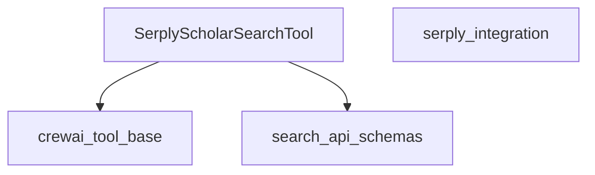

# serply_scholar_search Module Documentation

## Introduction

The `serply_scholar_search` module provides a specialized tool for performing scholarly literature searches through the Serply API. It enables AI agents to access academic articles, research papers, and other scholarly content, extracting relevant information such as titles, links, descriptions, citations, and authors.

## Core Functionality

The primary functionality of this module is encapsulated within the `SerplyScholarSearchTool` class. This tool facilitates the following:

*   **Scholarly Literature Search**: Executes searches on the Serply Scholar API based on a provided query.
*   **API Key Management**: Securely retrieves the Serply API key from environment variables (`SERPLY_API_KEY`).
*   **Customizable Search Parameters**: Allows specification of host language (`hl`) and proxy location (`proxy_location`) to tailor search results.
*   **Result Parsing and Formatting**: Processes the JSON response from the Serply API, extracts key information for each article, and formats it into a human-readable string for agent consumption.

## Architecture and Component Relationships

The `serply_scholar_search` module is a leaf module within the `crewai_tools_web_search.serply_integration.serply_search_tools` hierarchy. Its core component, `SerplyScholarSearchTool`, interacts with the Serply API to fetch scholarly data.

<!-- DIAGRAM_JSON
{
    "direction": "TD",
    "nodes": [
        {"id": "serply_scholar_search_tool", "label": "SerplyScholarSearchTool", "type": "component", "link": null},
        {"id": "serply_integration", "label": "serply_integration", "type": "external", "link": "serply_integration.md"},
        {"id": "crewai_tool_base", "label": "crewai_tool_base", "type": "external", "link": "crewai_tool_base.md"},
        {"id": "search_api_schemas", "label": "search_api_schemas", "type": "external", "link": "search_api_schemas.md"}
    ],
    "edges": [
        {"source": "serply_scholar_search_tool", "target": "crewai_tool_base"},
        {"source": "serply_scholar_search_tool", "target": "search_api_schemas"}
    ],
    "groups": []
}
-->

### Component Details

#### `SerplyScholarSearchTool`

*   **Location**: `lib/crewai-tools/src/crewai_tools/tools/serply_api_tool/serply_scholar_search_tool.py`
*   **Purpose**: This class is a `BaseTool` implementation designed to interface with the Serply Scholar API. It acts as the primary mechanism for agents to initiate and process scholarly searches.
*   **Key Attributes**:
    *   `name`: "Scholar Search"
    *   `description`: Provides a clear explanation of the tool's function.
    *   `args_schema`: References `SerplyScholarSearchToolSchema` for input validation, ensuring that search queries are properly structured.
    *   `search_url`: The endpoint for the Serply Scholar API.
    *   `hl`: Host language for search results (e.g., "us").
    *   `proxy_location`: Specifies the geographical proxy for the search.
    *   `headers`: Contains necessary HTTP headers, including the `X-API-KEY` (retrieved from `SERPLY_API_KEY` environment variable) and `User-Agent`.
    *   `env_vars`: Defines the required environment variables, specifically `SERPLY_API_KEY`.
*   **`_run` Method**: This method is executed when the tool is called. It constructs the API request payload, makes a GET request to the Serply API, and then parses the JSON response to extract and format article details. It handles cases where articles might not be found or have missing fields.

### Dependencies

*   **`crewai_tool_base`**: The `SerplyScholarSearchTool` inherits from `BaseTool` defined in `crewai_tool_base`, providing foundational structure and integration with the CrewAI framework. See [crewai_tool_base](crewai_tool_base.md) for more information.
*   **`search_api_schemas`**: This module is expected to provide `SerplyScholarSearchToolSchema`, which defines the input arguments for the scholar search tool, ensuring type safety and validation. See [search_api_schemas](search_api_schemas.md) for more information.
*   **`serply_integration`**: This module is part of the broader `serply_integration` within `crewai_tools_web_search`, indicating its role in a suite of Serply-related tools. See [serply_integration](serply_integration.md) for more information.