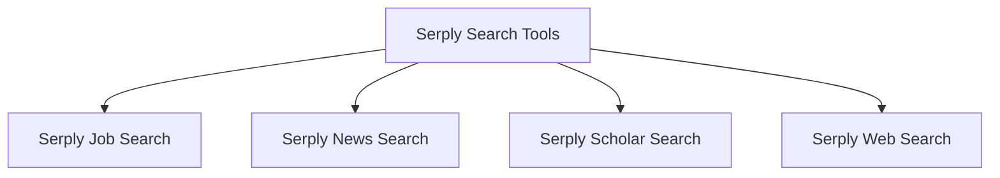

# Serply Search Tools Module Documentation

## Introduction

The `serply_search_tools` module provides a suite of specialized search tools that leverage the Serply API to perform various types of content searches, including job postings, news articles, scholarly literature, and general web results. This module is designed to integrate seamlessly into agent-based systems, allowing for efficient and targeted data retrieval.

## Architecture Overview

The `serply_search_tools` module acts as an interface to the Serply API, abstracting the complexities of API requests and responses into easy-to-use tools. Each core component within this module is a `BaseTool` or `RagTool` subclass, offering a specific search capability. These tools handle API key authentication, query parameter construction, request execution, and structured parsing of results.

### Module Relationships

This module is a child of the `serply_integration` module within the `crewai_tools_web_search` family, signifying its role in providing web search capabilities through the Serply platform. It depends on external `requests` library for HTTP communication and `os` for environment variable management.

<!-- DIAGRAM_JSON
{
    "direction": "TD",
    "nodes": [
        {"id": "serply_search_tools_module", "label": "Serply Search Tools", "type": "module"},
        {"id": "serply_job_search", "label": "Serply Job Search", "type": "module", "link": "serply_job_search.md"},
        {"id": "serply_news_search", "label": "Serply News Search", "type": "module", "link": "serply_news_search.md"},
        {"id": "serply_scholar_search", "label": "Serply Scholar Search", "type": "module", "link": "serply_scholar_search.md"},
        {"id": "serply_web_search", "label": "Serply Web Search", "type": "module", "link": "serply_web_search.md"}
    ],
    "edges": [
        {"source": "serply_search_tools_module", "target": "serply_job_search"},
        {"source": "serply_search_tools_module", "target": "serply_news_search"},
        {"source": "serply_search_tools_module", "target": "serply_scholar_search"},
        {"source": "serply_search_tools_module", "target": "serply_web_search"}
    ],
    "groups": []
}
-->

## High-Level Functionality of Sub-modules

*   ### [Serply Job Search](serply_job_search.md)
    This sub-module provides the `SerplyJobSearchTool`, designed to perform targeted job searches within the US. It allows agents to query for job postings based on specific criteria and retrieve structured results including position, employer, location, and key highlights.

*   ### [Serply News Search](serply_news_search.md)
    The `SerplyNewsSearchTool` within this sub-module enables agents to search for news articles. It supports specifying query parameters and proxy locations to fetch relevant news results, providing titles, links, sources, and publication dates.

*   ### [Serply Scholar Search](serply_scholar_search.md)
    This sub-module includes the `SerplyScholarSearchTool`, which is used for academic and scholarly literature searches. It allows for queries with specified host languages and proxy locations to retrieve academic articles, including titles, links, descriptions, citations, and authors.

*   ### [Serply Web Search](serply_web_search.md)
    The `SerplyWebSearchTool` in this sub-module offers a general-purpose web search capability, essentially performing Google searches via the Serply API. It supports parameters like host language, result limit, device type, and proxy location to deliver relevant web results with titles, links, and descriptions.
