# Server Authentication Schemes

The `server_auth_schemes` module provides a comprehensive suite of authentication mechanisms for the Agent-to-Agent (A2A) server within CrewAI. It defines various server-side authentication schemes that can be used to secure communication between agents and external services. This module is critical for ensuring that only authorized entities can interact with the server, supporting different security requirements from simple token validation to complex OAuth2 and OpenID Connect flows.

## Architecture Overview

The `server_auth_schemes` module acts as a central point for implementing and managing different server-side authentication strategies. Each authentication scheme is implemented as a distinct class, inheriting from a common base, ensuring a consistent interface for authentication handling. The module is designed to be extensible, allowing for easy integration of new authentication methods.

### Sub-modules

This module is composed of several sub-modules, each dedicated to a specific authentication scheme:

- [API Key Server Authentication](api_key_server_auth.md): Handles authentication via API keys.
- [Enterprise Token Authentication](enterprise_token_auth.md): Provides a placeholder for enterprise-specific token validation.
- [Mutual TLS Server Authentication](mtls_server_auth.md): Declares support for mTLS, with actual validation occurring at the transport layer.
- [OAuth2 Server Authentication](oauth2_server_auth.md): Implements robust OAuth2 token validation, including JWKS and introspection.
- [OpenID Connect Authentication](oidc_auth.md): Manages OpenID Connect (OIDC) JWT validation.
- [Simple Token Authentication](simple_token_auth.md): Offers a straightforward bearer token authentication method.

## Module Relationships

The following diagram illustrates the relationships between the `server_auth_schemes` module and its various authentication scheme sub-modules.

<!-- DIAGRAM_JSON
{
    "direction": "TD",
    "nodes": [
        {"id": "sas", "label": "Server Auth Schemes", "type": "module"},
        {"id": "api_key_server_auth", "label": "API Key Server Auth", "type": "module", "link": "api_key_server_auth.md"},
        {"id": "enterprise_token_auth", "label": "Enterprise Token Auth", "type": "module", "link": "enterprise_token_auth.md"},
        {"id": "mtls_server_auth", "label": "MTLS Server Auth", "type": "module", "link": "mtls_server_auth.md"},
        {"id": "oauth2_server_auth", "label": "OAuth2 Server Auth", "type": "module", "link": "oauth2_server_auth.md"},
        {"id": "oidc_auth", "label": "OIDC Auth", "type": "module", "link": "oidc_auth.md"},
        {"id": "simple_token_auth", "label": "Simple Token Auth", "type": "module", "link": "simple_token_auth.md"}
    ],
    "edges": [
        {"source": "sas", "target": "api_key_server_auth"},
        {"source": "sas", "target": "enterprise_token_auth"},
        {"source": "sas", "target": "mtls_server_auth"},
        {"source": "sas", "target": "oauth2_server_auth"},
        {"source": "sas", "target": "oidc_auth"},
        {"source": "sas", "target": "simple_token_auth"}
    ],
    "groups": []
}
-->

```mermaid
graph TD
    sas[Server Auth Schemes]
    api_key_server_auth[API Key Server Authentication]
    enterprise_token_auth[Enterprise Token Authentication]
    mtls_server_auth[Mutual TLS Server Authentication]
    oauth2_server_auth[OAuth2 Server Authentication]
    oidc_auth[OpenID Connect Authentication]
    simple_token_auth[Simple Token Authentication]

    sas --> api_key_server_auth
    sas --> enterprise_token_auth
    sas --> mtls_server_auth
    sas --> oauth2_server_auth
    sas --> oidc_auth
    sas --> simple_token_auth

    click api_key_server_auth "api_key_server_auth.md" "View API Key Server Authentication Documentation"
    click enterprise_token_auth "enterprise_token_auth.md" "View Enterprise Token Authentication Documentation"
    click mtls_server_auth "mtls_server_auth.md" "View Mutual TLS Server Authentication Documentation"
    click oauth2_server_auth "oauth2_server_auth.md" "View OAuth2 Server Authentication Documentation"
    click oidc_auth "oidc_auth.md" "View OpenID Connect Authentication Documentation"
    click simple_token_auth "simple_token_auth.md" "View Simple Token Authentication Documentation"
```
