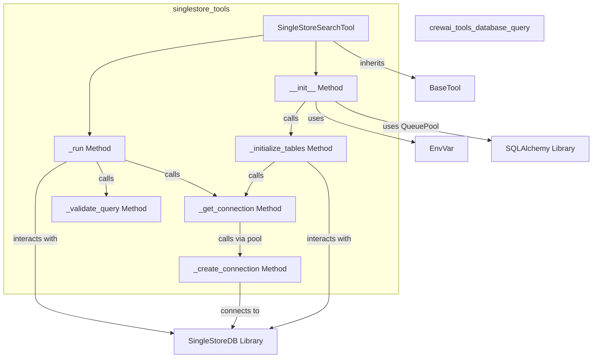

# SingleStore Tools Module Documentation

## Introduction

The `singlestore_tools` module provides a specialized tool for interacting with SingleStore databases: the `SingleStoreSearchTool`. This tool is designed to perform semantic searches by executing `SELECT` and `SHOW` SQL queries, offering a secure and efficient way to retrieve information from SingleStore tables. It incorporates connection pooling for performance optimization and includes robust query validation to prevent unauthorized operations.

This module is a sub-module of [`crewai_tools_database_query`](crewai_tools_database_query.md), focusing specifically on SingleStore database interactions within the broader `crewai-tools` ecosystem.

## Architecture and Component Relationships

The `SingleStoreSearchTool` is the core component of this module. It inherits from `BaseTool` (defined in [`crewai_tool_base`](crewai_tool_base.md)) and leverages several internal methods to manage database connections, validate queries, and execute searches. It depends on the `singlestoredb` and `SQLAlchemy` Python libraries for database connectivity and connection pooling, respectively.

<!-- DIAGRAM_JSON
{
    "direction": "TD",
    "nodes": [
        {"id": "singlestore_search_tool", "label": "SingleStoreSearchTool", "type": "component", "link": null},
        {"id": "init_method", "label": "__init__ Method", "type": "component", "link": null},
        {"id": "initialize_tables", "label": "_initialize_tables Method", "type": "component", "link": null},
        {"id": "get_connection", "label": "_get_connection Method", "type": "component", "link": null},
        {"id": "create_connection", "label": "_create_connection Method", "type": "component", "link": null},
        {"id": "validate_query", "label": "_validate_query Method", "type": "component", "link": null},
        {"id": "run_method", "label": "_run Method", "type": "component", "link": null},
        {"id": "base_tool", "label": "BaseTool", "type": "external", "link": "crewai_tool_base.md"},
        {"id": "env_var", "label": "EnvVar", "type": "external", "link": "crewai_tools_adapters.md"},
        {"id": "singlestore_db_lib", "label": "SingleStoreDB Library", "type": "external", "link": null},
        {"id": "sqlalchemy_lib", "label": "SQLAlchemy Library", "type": "external", "link": null},
        {"id": "database_query_parent", "label": "crewai_tools_database_query", "type": "external", "link": "crewai_tools_database_query.md"}
    ],
    "edges": [
        {"source": "singlestore_search_tool", "target": "base_tool", "label": "inherits"},
        {"source": "singlestore_search_tool", "target": "init_method"},
        {"source": "init_method", "target": "env_var", "label": "uses"},
        {"source": "init_method", "target": "sqlalchemy_lib", "label": "uses QueuePool"},
        {"source": "init_method", "target": "initialize_tables", "label": "calls"},
        {"source": "initialize_tables", "target": "get_connection", "label": "calls"},
        {"source": "initialize_tables", "target": "singlestore_db_lib", "label": "interacts with"},
        {"source": "get_connection", "target": "create_connection", "label": "calls via pool"},
        {"source": "create_connection", "target": "singlestore_db_lib", "label": "connects to"},
        {"source": "singlestore_search_tool", "target": "run_method", "label": "executes"},
        {"source": "run_method", "target": "validate_query", "label": "calls"},
        {"source": "run_method", "target": "get_connection", "label": "calls"},
        {"source": "run_method", "target": "singlestore_db_lib", "label": "interacts with"}
    ],
    "groups": [
        {"id": "singlestore_tools", "label": "singlestore_tools", "nodes": ["singlestore_search_tool", "init_method", "initialize_tables", "get_connection", "create_connection", "validate_query", "run_method"]}
    ]
}
-->

### `SingleStoreSearchTool`

**Purpose:** This class serves as the primary interface for performing secure semantic searches against a SingleStore database. It abstracts away the complexities of database connections and query handling, providing a streamlined experience for agents.

**Key Functionality:**

*   **Connection Management:** Establishes and manages connections to a SingleStore database using a configurable set of parameters (host, user, password, database, SSL options, etc.). It supports connection pooling through `SQLAlchemy`'s `QueuePool` for efficient resource utilization.
*   **Table Initialization and Validation:** Upon instantiation, the tool validates the existence of specified tables or discovers all available tables in the connected database. It then updates its description to include schema information for the relevant tables, enhancing the tool's self-describing capabilities for AI agents.
*   **Secure Query Execution:** It strictly enforces a security policy allowing only `SELECT` and `SHOW` SQL queries. This prevents agents from executing potentially destructive or unauthorized database operations. All queries are validated before execution.
*   **Result Formatting:** Fetches query results and formats them into a readable string, making it easy for AI agents to parse and utilize the information.
*   **Dependency Management:** Automatically prompts for and installs the `singlestoredb` package if it's not found, simplifying setup.

**Methods:**

*   `__init__(...)`: Initializes the tool instance, processes connection arguments, sets up the connection pool, and calls `_initialize_tables` to prepare table metadata.
*   `_initialize_tables(tables: list[str])`: Validates the provided list of tables against the database's existing tables and updates the tool's description with schema details. If no tables are specified, it discovers all tables.
*   `_get_connection()`: Retrieves an active database connection from the `QueuePool`.
*   `_create_connection()`: A private method used by `QueuePool` to establish a new `singlestoredb` connection based on the configured `connection_args`.
*   `_validate_query(search_query: str)`: Ensures that the `search_query` is a safe `SELECT` or `SHOW` statement, returning a boolean indicating validity and a corresponding message.
*   `_run(search_query: str)`: The core execution method. It validates the incoming query using `_validate_query`, obtains a connection, executes the query, fetches results, and formats them into a string. It also handles exceptions during query execution.

## How the Module Fits into the Overall System

The `singlestore_tools` module is an integral part of the `crewai-tools` library, specifically designed to extend the capabilities of AI agents with direct, secure access to SingleStore databases. It resides under the [`crewai_tools_database_query`](crewai_tools_database_query.md) umbrella, acting as a concrete implementation for database interaction tailored to SingleStore.

Agents within the CrewAI framework can utilize the `SingleStoreSearchTool` to query SingleStore databases for information, analyze data, and support decision-making processes, all while adhering to security best practices through enforced query validation.

By providing a standardized `BaseTool` interface, `SingleStoreSearchTool` seamlessly integrates into existing CrewAI workflows, allowing agents to easily incorporate real-time or historical data from SingleStore into their tasks without needing deep knowledge of SQL or database specifics. This modular design promotes reusability and maintainability across the larger system.