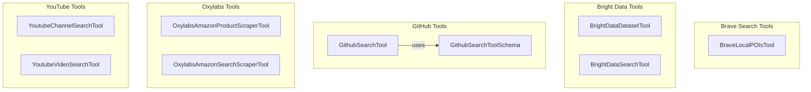

# specialized_data_search
This module offers a suite of specialized tools designed for efficient data retrieval and scraping across diverse platforms, including local POIs, web search engines, GitHub repositories, Amazon, and YouTube content. It integrates with various APIs to provide structured and semantic search capabilities.

<!-- DIAGRAM_JSON
{
  "nodes": [
    {
      "id": "BraveLocalPOIsTool",
      "label": "BraveLocalPOIsTool"
    },
    {
      "id": "BrightDataDatasetTool",
      "label": "BrightDataDatasetTool"
    },
    {
      "id": "BrightDataSearchTool",
      "label": "BrightDataSearchTool"
    },
    {
      "id": "GithubSearchTool",
      "label": "GithubSearchTool"
    },
    {
      "id": "GithubSearchToolSchema",
      "label": "GithubSearchToolSchema"
    },
    {
      "id": "OxylabsAmazonProductScraperTool",
      "label": "OxylabsAmazonProductScraperTool"
    },
    {
      "id": "OxylabsAmazonSearchScraperTool",
      "label": "OxylabsAmazonSearchScraperTool"
    },
    {
      "id": "YoutubeChannelSearchTool",
      "label": "YoutubeChannelSearchTool"
    },
    {
      "id": "YoutubeVideoSearchTool",
      "label": "YoutubeVideoSearchTool"
    }
  ],
  "edges": [
    {
      "source": "GithubSearchTool",
      "target": "GithubSearchToolSchema",
      "label": "uses"
    }
  ],
  "groups": [
    {
      "id": "BraveSearch",
      "label": "Brave Search Tools",
      "nodes": [
        "BraveLocalPOIsTool"
      ]
    },
    {
      "id": "BrightData",
      "label": "Bright Data Tools",
      "nodes": [
        "BrightDataDatasetTool",
        "BrightDataSearchTool"
      ]
    },
    {
      "id": "GitHub",
      "label": "GitHub Tools",
      "nodes": [
        "GithubSearchTool",
        "GithubSearchToolSchema"
      ]
    },
    {
      "id": "Oxylabs",
      "label": "Oxylabs Tools",
      "nodes": [
        "OxylabsAmazonProductScraperTool",
        "OxylabsAmazonSearchScraperTool"
      ]
    },
    {
      "id": "YouTube",
      "label": "YouTube Tools",
      "nodes": [
        "YoutubeChannelSearchTool",
        "YoutubeVideoSearchTool"
      ]
    }
  ]
}
-->
