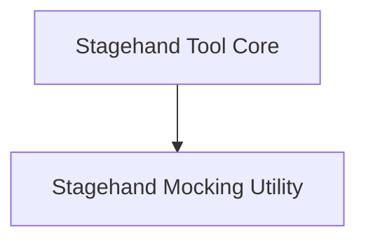

# `stagehand_tool` Module Documentation

## Introduction
The `stagehand_tool` module provides a powerful web automation tool that allows AI agents to interact with web browsers using natural language. It leverages the Stagehand library to perform actions such as navigation, clicking, typing, extracting data, and observing page elements. This module is essential for tasks requiring dynamic interaction with websites within an agentic workflow.

## Architecture Overview
The `stagehand_tool` module is composed of two main sub-modules: the core implementation of the Stagehand tool and a mocking utility for testing. The `stagehand_tool_implementation` handles all actual web interactions and configuration, while the `stagehand_tool_mock` provides a simulated environment for development and testing without requiring a live browser.

<!-- DIAGRAM_JSON
{
    "direction": "TD",
    "nodes": [
        {"id": "stagehand_tool_implementation", "label": "Stagehand Tool Core", "type": "module", "link": "stagehand_tool_implementation.md"},
        {"id": "stagehand_tool_mock", "label": "Stagehand Mocking Utility", "type": "module", "link": "stagehand_tool_mock.md"}
    ],
    "edges": [
        {"source": "stagehand_tool_implementation", "target": "stagehand_tool_mock", "label": "Utilizes for testing"}
    ],
    "groups": []
}
-->

## Sub-modules

### `stagehand_tool_implementation`
This sub-module contains the primary `StagehandTool` class, which is responsible for orchestrating web browser automation. It encapsulates the logic for configuring Stagehand, handling various command types (`act`, `navigate`, `extract`, `observe`), parsing natural language instructions into actionable steps, and managing API keys for different language models. It provides both synchronous and asynchronous methods for executing web automation tasks.
Refer to [stagehand_tool_implementation.md](stagehand_tool_implementation.md) for detailed documentation.

### `stagehand_tool_mock`
The `stagehand_tool_mock` sub-module provides a `MockStagehand` class, which serves as a testing utility. This mock object simulates the behavior of the real Stagehand tool, allowing developers to test components that rely on web automation without the overhead of actual browser interactions. It's crucial for unit testing and continuous integration environments.
Refer to [stagehand_tool_mock.md](stagehand_tool_mock.md) for detailed documentation.
