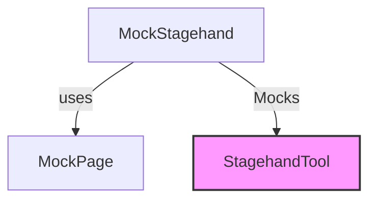

# `stagehand_tool_mock`

## Introduction
The `stagehand_tool_mock` module provides a mock implementation of the `StagehandTool`, primarily used for testing and development purposes. It allows for the simulation of browser automation interactions without requiring an actual browser environment, facilitating isolated testing of components that depend on the `StagehandTool`.

## Architecture and Component Relationships

The `stagehand_tool_mock` module's core component is `MockStagehand`, which mimics the behavior of the real `StagehandTool`. It interacts with a `MockPage` to simulate browser page operations.

<!-- DIAGRAM_JSON
{
    "direction": "TD",
    "nodes": [
        {"id": "mock_stagehand", "label": "MockStagehand", "type": "component", "link": null},
        {"id": "mock_page", "label": "MockPage", "type": "component", "link": null},
        {"id": "stagehand_tool", "label": "StagehandTool", "type": "external", "link": "stagehand_tool_implementation.md"}
    ],
    "edges": [
        {"source": "mock_stagehand", "target": "mock_page", "label": "uses"},
        {"source": "mock_stagehand", "target": "stagehand_tool", "label": "Mocks"}
    ],
    "groups": []
}
-->

## Core Functionality

### `MockStagehand`
`MockStagehand` is a simulated version of the `StagehandTool`. It provides basic methods to mimic the lifecycle of a browser session:

- **`__init__(self) -> None`**: Initializes the `MockStagehand` instance. It sets up a `MockPage` instance to simulate a browser page and assigns a test `session_id`.
- **`async init(self) -> None`**: An asynchronous method that simulates the initialization of a browser session. In this mock implementation, it performs no actual operations.
- **`async close(self) -> None`**: An asynchronous method that simulates closing the browser session. Similar to `init`, it performs no actual operations.

This mock allows for the development and testing of features that integrate with browser automation tools without the overhead of a real browser, ensuring faster feedback cycles and more stable tests.

## How it Fits into the Overall System
The `stagehand_tool_mock` module is part of the `crewai_tools_platform_automation` family, specifically within the `stagehand_tool` sub-module. It serves as a testing utility for the actual `StagehandTool`, which is responsible for real browser interactions. By providing a mock, it allows other modules in the system that depend on browser automation to be tested independently of a live browser, thereby improving the robustness and efficiency of the testing process.

For more details on the actual implementation of the Stagehand tool, refer to the [stagehand_tool_implementation](stagehand_tool_implementation.md) documentation.