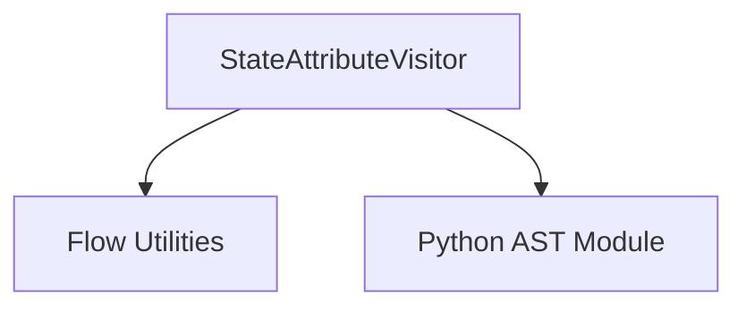

# state_attribute_visitor_module

## Introduction
The `state_attribute_visitor_module` houses the `StateAttributeVisitor` class, a specialized AST (Abstract Syntax Tree) visitor designed to parse Python code and identify specific patterns related to state attribute comparisons. This module plays a crucial role in analyzing agent flow logic, particularly in scenarios where the system needs to understand how `self.state` attributes are being evaluated against constant values.

## Core Functionality
The primary function of this module is to provide a mechanism for extracting state attributes and their associated string literal values from comparison expressions within an AST. It is particularly focused on expressions of the form `self.state.attribute == "value"`.

### `StateAttributeVisitor`
The `StateAttributeVisitor` class, inheriting from `ast.NodeVisitor`, is the central component. It overrides the `visit_Compare` method to intercept comparison nodes in the AST.

- **Purpose**: To traverse an AST and identify comparison operations where a `self.state` attribute is compared against a string literal.
- **Mechanism**:
    - When a `Compare` node is encountered, it attempts to extract an attribute chain from both the left-hand side and the right-hand side of the comparison using the `get_attribute_chain` utility function.
    - If a `self.state` attribute is found on the left side and is compared to a string constant on the right, it records the attribute and the string value.
    - Conversely, if a `self.state` attribute is on the right side and compared to a string constant on the left, it also records this information.
    - The extracted state attributes and their corresponding string values are stored in a dictionary, `state_attribute_values`, which is expected to be accessible to the visitor.

## Architecture and Component Relationships

<!-- DIAGRAM_JSON
{
    "direction": "TD",
    "nodes": [
        {"id": "state_attribute_visitor", "label": "StateAttributeVisitor", "type": "component", "link": null},
        {"id": "flow_utils", "label": "Flow Utilities", "type": "external", "link": "flow_utils.md"},
        {"id": "python_ast_module", "label": "Python AST Module", "type": "external", "link": null}
    ],
    "edges": [
        {"source": "state_attribute_visitor", "target": "flow_utils"},
        {"source": "state_attribute_visitor", "target": "python_ast_module"}
    ],
    "groups": []
}
-->

- **`StateAttributeVisitor`**: This is the core component of this module, responsible for the AST traversal and extraction logic.
- **`Flow Utilities` ([flow_utils.md](flow_utils.md))**: This external module likely provides helper functions such as `get_attribute_chain`, which is crucial for identifying attribute access patterns within the AST. It also implicitly manages the `state_attribute_values` dictionary that the visitor populates.
- **`Python AST Module`**: This is a standard Python library module that provides the Abstract Syntax Tree classes and utilities, including `ast.NodeVisitor`, which `StateAttributeVisitor` extends.

## Integration with the Overall System
The `state_attribute_visitor_module` is a specialized utility within the broader `crewai_flow_management` system, specifically under `ast_visitors`. It contributes to the static analysis capabilities of the system by enabling the extraction of information about how `self.state` attributes are used in conditional logic. This information can be used for various purposes, such as:

- **Flow Analysis**: Understanding the conditions under which different parts of a flow are executed based on the agent's state.
- **Validation**: Ensuring that state attributes are used consistently and correctly.
- **Documentation Generation**: Automatically documenting the possible values and conditions associated with specific state attributes.

By providing a precise way to identify state attribute comparisons, this module helps in building more robust and understandable agent flows. It works in conjunction with other AST visitors, such as those found in `return_visitor_module` and `variable_assignment_visitor_module`, to provide a comprehensive view of flow logic.