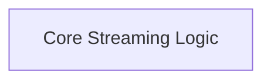

# Streaming Handler Implementation

The `streaming_handler_implementation` module is responsible for handling Server-Sent Events (SSE) streaming for Agent-to-Agent (A2A) communication within the CrewAI framework. It manages the execution of tasks via streaming, handles connection interruptions, and processes real-time updates and artifacts.

## Architecture Overview

This module primarily consists of the core streaming handler logic, which manages the lifecycle of streaming connections and message processing.

<!-- DIAGRAM_JSON
{
    "direction": "TD",
    "nodes": [
        {"id": "streaming_handler_core_logic", "label": "Core Streaming Logic", "type": "module", "link": "streaming_handler_core_logic.md"}
    ],
    "edges": [],
    "groups": []
}
-->

## Sub-modules

### [Core Streaming Logic](streaming_handler_core_logic.md)
This sub-module contains the `StreamingHandler` class, which is the central component for managing SSE streams. It includes methods for executing streaming tasks, recovering from connection interruptions, processing incoming messages, and emitting relevant events through the CrewAI event bus. It also defines the `StreamingHandlerKwargs` for configuring the streaming handler.