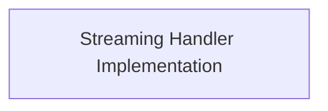

# Streaming Handlers Module

## Introduction
This module is responsible for managing Server-Sent Events (SSE) streaming for Agent-to-Agent (A2A) communication within CrewAI. It handles the real-time delivery of updates, messages, and artifacts during task execution, and includes robust mechanisms for recovering from stream interruptions.

## Architecture Overview
The `streaming_handlers` module primarily consists of the `StreamingHandler` class, which orchestrates the streaming process and interacts with the A2A client to send messages and receive events. It also defines the necessary keyword arguments for configuring streaming operations.

<!-- DIAGRAM_JSON
{
    "direction": "TD",
    "nodes": [
        {"id": "streaming_handler_implementation", "label": "Streaming Handler Implementation", "type": "module", "link": "streaming_handler_implementation.md"}
    ],
    "edges": [],
    "groups": []
}
-->

## Sub-modules:

*   **[Streaming Handler Implementation](streaming_handler_implementation.md)**: This sub-module contains the core logic for managing SSE streaming, including initiating streaming, processing incoming events, handling various update types (messages, artifacts, status), and implementing recovery mechanisms for stream interruptions. It also defines the parameters used for configuring streaming operations.
