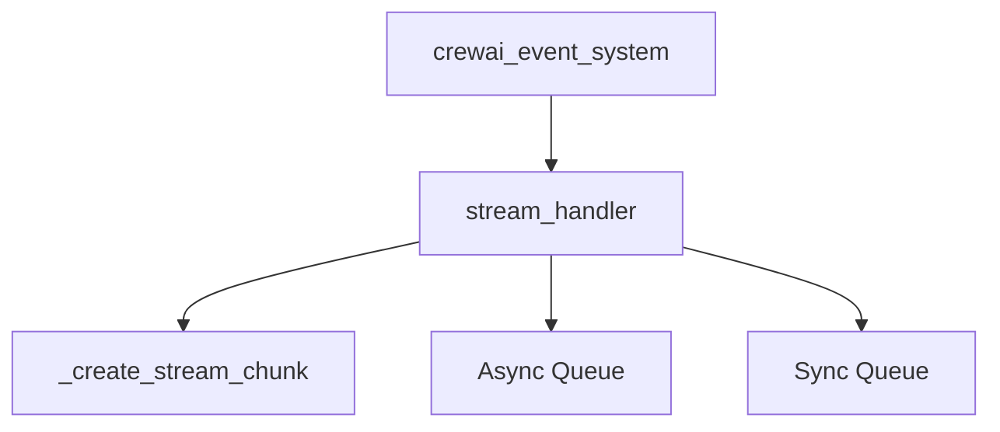

# Module: `streaming_output_handling`

## Introduction
The `streaming_output_handling` module is a vital component within the `crewai_utilities.output_handling` package, specifically designed to manage and process real-time streaming data, particularly from Large Language Models (LLMs). It ensures that incoming data chunks are efficiently handled and enqueued for subsequent processing, supporting both synchronous and asynchronous operational modes.

## Purpose and Core Functionality
The primary purpose of this module is to provide a robust mechanism for capturing and distributing stream chunks from various event sources. Its core functionality revolves around the `stream_handler` function, which acts as an entry point for processing `LLMStreamChunkEvent` events. This function intelligently routes the processed chunks to either an asynchronous or synchronous queue, ensuring non-blocking operations where an event loop is available. This design is crucial for maintaining responsiveness in applications that rely on continuous data streams.

## Architecture and Component Relationships

The `streaming_output_handling` module is centered around its `stream_handler` function, which orchestrates the reception and dispatch of streaming data.

<!-- DIAGRAM_JSON
{
    "direction": "TD",
    "nodes": [
        {"id": "stream_handler", "label": "stream_handler", "type": "component", "link": null},
        {"id": "create_stream_chunk", "label": "_create_stream_chunk", "type": "component", "link": null},
        {"id": "async_queue", "label": "Async Queue", "type": "component", "link": null},
        {"id": "sync_queue", "label": "Sync Queue", "type": "component", "link": null},
        {"id": "crewai_event_system", "label": "crewai_event_system", "type": "external", "link": "crewai_event_system.md"}
    ],
    "edges": [
        {"source": "stream_handler", "target": "create_stream_chunk"},
        {"source": "stream_handler", "target": "async_queue"},
        {"source": "stream_handler", "target": "sync_queue"},
        {"source": "crewai_event_system", "target": "stream_handler"}
    ],
    "groups": []
}
-->

### Core Components:

*   **`stream_handler`**: This is the main function responsible for handling `LLMStreamChunkEvent` events. It filters events, calls `_create_stream_chunk` to process the event data, and then places the resulting chunk into the appropriate queue (asynchronous or synchronous).
*   **`_create_stream_chunk` (internal)**: An unexposed helper function that transforms an `LLMStreamChunkEvent` and `current_task_info` into a structured stream chunk.
*   **`async_queue` (internal)**: An asynchronous queue used when an `asyncio` event loop is present, allowing for non-blocking enqueue operations.
*   **`sync_queue` (internal)**: A synchronous queue used as a fallback when no asynchronous event loop is available.

### External Dependencies:

*   **`crewai_event_system`**: This module provides the `BaseEvent` and `LLMStreamChunkEvent` classes, which are fundamental to the `stream_handler`'s operation. The `stream_handler` function specifically listens for and processes events of type `LLMStreamChunkEvent`. For more details, refer to [crewai_event_system.md](crewai_event_system.md).

## How the Module Fits into the Overall System
The `streaming_output_handling` module plays a critical role in the CrewAI ecosystem by providing the foundational infrastructure for real-time output processing, especially from LLMs. It is a sub-module of `crewai_utilities.output_handling`, which itself is part of the broader `crewai_utilities` package.

It acts as a bridge between event-generating components (like LLMs that emit stream chunks) and downstream consumers that require this data for display, logging, or further computational tasks. By efficiently managing streaming chunks, it ensures that agents and other system components can react promptly to incoming information without being blocked by I/O operations, thereby enhancing the overall responsiveness and performance of the CrewAI framework.