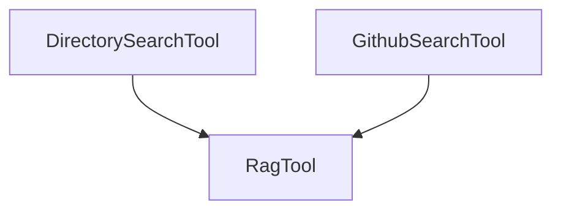

# `structural_search_tools`

## Introduction

The `structural_search_tools` module provides specialized tools for performing semantic searches within structured data sources. Currently, it supports searching local directories and GitHub repositories, enabling powerful information retrieval capabilities for agents.

## Purpose and Core Functionality

This module's primary purpose is to offer agents the ability to semantically search content within specific structures, such as file systems or version control repositories. By abstracting the complexities of data ingestion and search, it allows agents to efficiently find relevant information based on query semantics rather than just keyword matching.

### Core Components

#### `DirectorySearchTool`

- **Description**: A tool designed for semantic searching within the content of a specified local directory. It leverages a underlying RAG (Retrieval-Augmented Generation) system to provide intelligent search results.
- **Functionality**:
    - Initializes with an optional `directory` path, dynamically adjusting its description and argument schema.
    - Allows adding new directories to its search scope.
    - Executes semantic queries against the aggregated content of the configured directories.
- **Dependencies**: Inherits from `RagTool` (from `crewai_tool_base`).

#### `GithubSearchTool`

- **Description**: A tool for performing semantic searches within the content of a specified GitHub repository. Unlike direct API interaction, this tool focuses on providing semantic search capabilities over the repository's content.
- **Functionality**:
    - Requires a GitHub repository URL and a GitHub token (`gh_token`) for authentication.
    - Supports searching specific content types within the repository (e.g., code, repository files, pull requests, issues).
    - Dynamically updates its description and argument schema upon initialization with a `github_repo`.
    - Executes semantic queries against the specified GitHub repository content.
- **Dependencies**: Inherits from `RagTool` (from `crewai_tool_base`).

## Architecture and Component Relationships

The `structural_search_tools` module acts as a specialized layer for accessing structured content via semantic search. Both `DirectorySearchTool` and `GithubSearchTool` build upon the foundational capabilities provided by the `RagTool`, integrating seamlessly into the broader CrewAI tool ecosystem.

<!-- DIAGRAM_JSON
{
    "direction": "TD",
    "nodes": [
        {"id": "directory_search_tool", "label": "DirectorySearchTool", "type": "component", "link": null},
        {"id": "github_search_tool", "label": "GithubSearchTool", "type": "component", "link": null},
        {"id": "rag_tool", "label": "RagTool", "type": "external", "link": "crewai_tool_base.md"}
    ],
    "edges": [
        {"source": "directory_search_tool", "target": "rag_tool"},
        {"source": "github_search_tool", "target": "rag_tool"}
    ],
    "groups": []
}
-->

## How the Module Fits into the Overall System

This module is a crucial part of the `crewai_tools_data_file_tools` family, specifically nested under `file_type_search_tools` and `file_content_search_tools`. It provides concrete implementations for searching specific data structures (directories and GitHub repositories), extending the file search capabilities of the CrewAI framework. By offering these tools, agents can interact with and retrieve information from diverse structured data sources, enhancing their ability to perform complex tasks requiring data lookup and analysis. It leverages the underlying RAG system provided by [crewai_tool_base](crewai_tool_base.md) to perform its semantic search operations.