# structured_data_search
This module offers specialized tools for semantic searching across diverse structured data formats like CSV, DOCX, JSON, MDX, MySQL, and PDF. These tools are designed for efficient content retrieval within RAG systems.

<!-- DIAGRAM_JSON
{
  "nodes": [
    {"id": "CSVSearchTool", "label": "CSVSearchTool"},
    {"id": "CSVSearchToolSchema", "label": "CSVSearchToolSchema"},
    {"id": "DOCXSearchTool", "label": "DOCXSearchTool"},
    {"id": "DOCXSearchToolSchema", "label": "DOCXSearchToolSchema"},
    {"id": "JSONSearchTool", "label": "JSONSearchTool"},
    {"id": "JSONSearchToolSchema", "label": "JSONSearchToolSchema"},
    {"id": "MDXSearchTool", "label": "MDXSearchTool"},
    {"id": "MDXSearchToolSchema", "label": "MDXSearchToolSchema"},
    {"id": "MySQLSearchTool", "label": "MySQLSearchTool"},
    {"id": "MySQLSearchToolSchema", "label": "MySQLSearchToolSchema"},
    {"id": "PDFSearchTool", "label": "PDFSearchTool"},
    {"id": "PDFSearchToolSchema", "label": "PDFSearchToolSchema"}
  ],
  "edges": [
    {"source": "CSVSearchTool", "target": "CSVSearchToolSchema", "label": "uses"},
    {"source": "DOCXSearchTool", "target": "DOCXSearchToolSchema", "label": "uses"},
    {"source": "JSONSearchTool", "target": "JSONSearchToolSchema", "label": "uses"},
    {"source": "MDXSearchTool", "target": "MDXSearchToolSchema", "label": "uses"},
    {"source": "MySQLSearchTool", "target": "MySQLSearchToolSchema", "label": "uses"},
    {"source": "PDFSearchTool", "target": "PDFSearchToolSchema", "label": "uses"}
  ],
  "groups": [
    {"id": "CSV", "label": "CSV Tools", "nodes": ["CSVSearchTool", "CSVSearchToolSchema"]},
    {"id": "DOCX", "label": "DOCX Tools", "nodes": ["DOCXSearchTool", "DOCXSearchToolSchema"]},
    {"id": "JSON", "label": "JSON Tools", "nodes": ["JSONSearchTool", "JSONSearchToolSchema"]},
    {"id": "MDX", "label": "MDX Tools", "nodes": ["MDXSearchTool", "MDXSearchToolSchema"]},
    {"id": "MySQL", "label": "MySQL Tools", "nodes": ["MySQLSearchTool", "MySQLSearchToolSchema"]},
    {"id": "PDF", "label": "PDF Tools", "nodes": ["PDFSearchTool", "PDFSearchToolSchema"]}
  ]
}
-->

```mermaid
flowchart TD
    subgraph CSV Tools
        CSVSearchTool
        CSVSearchToolSchema
    end

    subgraph DOCX Tools
        DOCXSearchTool
        DOCXSearchToolSchema
    end

    subgraph JSON Tools
        JSONSearchTool
        JSONSearchToolSchema
    end

    subgraph MDX Tools
        MDXSearchTool
        MDXSearchToolSchema
    end

    subgraph MySQL Tools
        MySQLSearchTool
        MySQLSearchToolSchema
    end

    subgraph PDF Tools
        PDFSearchTool
        PDFSearchToolSchema
    end

    CSVSearchTool --> CSVSearchToolSchema
    DOCXSearchTool --> DOCXSearchToolSchema
    JSONSearchTool --> JSONSearchToolSchema
    MDXSearchTool --> MDXSearchToolSchema
    MySQLSearchTool --> MySQLSearchToolSchema
    PDFSearchTool --> PDFSearchToolSchema
```
