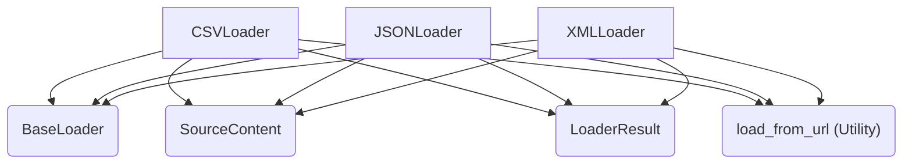

# Module: structured_file_loaders

## Introduction
The `structured_file_loaders` module is a crucial part of the RAG (Retrieval-Augmented Generation) system within the `crewai_tools_rag_loaders_and_chunkers` package. It specializes in extracting and parsing content from common structured data formats, specifically CSV, JSON, and XML. This module provides a standardized way to ingest structured data, whether from local files or web URLs, and transform it into a format suitable for downstream processing in AI agents and RAG pipelines.

## Purpose and Core Functionality
The primary purpose of this module is to abstract the complexities of reading and interpreting structured data files. Each loader handles the specifics of its respective format, converting the raw content into a unified `LoaderResult` object.

The module provides the following core functionalities:

1.  **CSVLoader**:
    *   **Functionality**: Reads CSV files or content from CSV-formatted URLs. It parses the data, identifies headers, and formats each row into a human-readable string, including column names and their values.
    *   **Output**: Produces a `LoaderResult` with the CSV content structured as text and metadata including format, columns, and row count.
    *   **Error Handling**: Gracefully handles malformed CSV content, returning the raw content and a parsing error in the metadata.

2.  **JSONLoader**:
    *   **Functionality**: Processes JSON data from files or URLs. It intelligently converts JSON objects (dictionaries) or arrays into a clear, line-separated string representation.
    *   **Output**: Generates a `LoaderResult` containing the JSON content as text, along with metadata indicating the format, type (dict, list, etc.), and size.
    *   **Error Handling**: Catches `json.JSONDecodeError` for invalid JSON, providing the raw content and an error message.

3.  **XMLLoader**:
    *   **Functionality**: Parses XML content from files or URLs. It extracts all meaningful text nodes from the XML structure and joins them into a single coherent text string.
    *   **Output**: Returns a `LoaderResult` with the extracted XML text and metadata indicating the format and the root tag of the XML document.
    *   **Error Handling**: Manages `ParseError` for invalid XML, reverting to raw content and including parsing error details.

All loaders inherit from `BaseLoader` and utilize a `SourceContent` object to manage the origin of the data, whether it's a file path or a URL. They also leverage a `load_from_url` utility for web-based content retrieval.

## Architecture and Component Relationships

The `structured_file_loaders` module consists of three main loader components, each designed for a specific structured file type. These components interact with external modules for base loading capabilities, source content abstraction, and URL handling.

<!-- DIAGRAM_JSON
{
    "direction": "TD",
    "nodes": [
        {"id": "csv_loader", "label": "CSVLoader", "type": "component", "link": null},
        {"id": "json_loader", "label": "JSONLoader", "type": "component", "link": null},
        {"id": "xml_loader", "label": "XMLLoader", "type": "component", "link": null},
        {"id": "base_loader", "label": "BaseLoader", "type": "external", "link": "base_components.md"},
        {"id": "source_content", "label": "SourceContent", "type": "external", "link": "base_components.md"},
        {"id": "loader_result", "label": "LoaderResult", "type": "external", "link": "base_components.md"},
        {"id": "load_from_url", "label": "load_from_url (Utility)", "type": "external", "link": "crewai_tools_rag_loaders_and_chunkers.md"}
    ],
    "edges": [
        {"source": "csv_loader", "target": "base_loader"},
        {"source": "json_loader", "target": "base_loader"},
        {"source": "xml_loader", "target": "base_loader"},
        {"source": "csv_loader", "target": "source_content"},
        {"source": "json_loader", "target": "source_content"},
        {"source": "xml_loader", "target": "source_content"},
        {"source": "csv_loader", "target": "loader_result"},
        {"source": "json_loader", "target": "loader_result"},
        {"source": "xml_loader", "target": "loader_result"},
        {"source": "csv_loader", "target": "load_from_url"},
        {"source": "json_loader", "target": "load_from_url"},
        {"source": "xml_loader", "target": "load_from_url"}
    ],
    "groups": []
}
-->

## How the Module Fits into the Overall System
The `structured_file_loaders` module plays a vital role within the larger [crewai_tools_rag_loaders_and_chunkers](crewai_tools_rag_loaders_and_chunkers.md) system, specifically as a sub-module of [file_loaders](file_loaders.md). It acts as the initial ingestion point for structured textual data, converting raw files into a standardized document format.

This module provides the foundation for:
*   **Data Ingestion for RAG**: By parsing structured files, it enables the RAG system to access and understand information stored in common data formats, which can then be chunked and indexed for retrieval.
*   **Agent Tooling**: The output of these loaders can be directly consumed by agents as part of their information retrieval or processing tasks, allowing agents to work with structured data efficiently.
*   **Extensibility**: By inheriting from `BaseLoader` and adhering to the `LoaderResult` interface, this module integrates seamlessly with other loaders and chunkers in the RAG pipeline, ensuring consistency and ease of extension for new structured formats.

It complements other loader modules, such as [plain_text_loaders](plain_text_loaders.md) and [document_loaders](document_loaders.md), by providing specialized handling for data with inherent structure, ensuring that critical metadata and relationships within the data are preserved or made accessible.