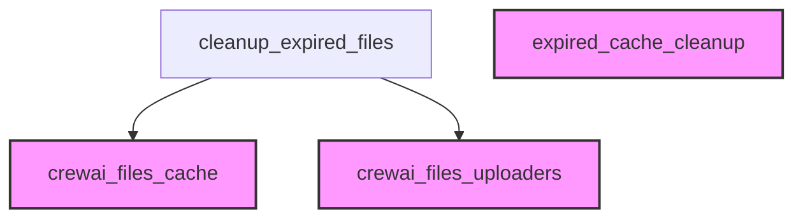

# `sync_cleanup_operations` Module Documentation

## Introduction

The `sync_cleanup_operations` module is responsible for synchronously removing expired files from the application's cache. It ensures that cached files that are no longer valid are purged, with an option to also delete these files from their respective external storage providers, maintaining data hygiene and optimizing storage usage.

## Architecture and Component Relationships

This module contains the core logic for the synchronous cleanup process, primarily through the `cleanup_expired_files` function. It interacts with the caching system to identify expired entries and, if configured, with file uploaders to remove files from external providers.

<!-- DIAGRAM_JSON
{
    "direction": "TD",
    "nodes": [
        {"id": "cleanup_expired_files", "label": "cleanup_expired_files", "type": "component", "link": null},
        {"id": "cache", "label": "crewai_files_cache", "type": "external", "link": "crewai_files_cache.md"},
        {"id": "uploader", "label": "crewai_files_uploaders", "type": "external", "link": "crewai_files_uploaders.md"},
        {"id": "expired_cache_cleanup", "label": "expired_cache_cleanup", "type": "external", "link": "expired_cache_cleanup.md"}
    ],
    "edges": [
        {"source": "cleanup_expired_files", "target": "cache"},
        {"source": "cleanup_expired_files", "target": "uploader"}
    ],
    "groups": []
}
-->


## Core Functionality

### `cleanup_expired_files`

```python
def cleanup_expired_files(
    cache: UploadCache,
    *,
    delete_from_provider: bool = False,
) -> int:
    """Clean up expired files from the cache.

    Args:
        cache: The upload cache to clean up.
        delete_from_provider: If True, attempt to delete from provider as well.
            Note: Expired files may already be deleted by the provider.

    Returns:
        Number of expired entries removed from cache.
    """
    expired_entries: list[CachedUpload] = []

    if delete_from_provider:
        for provider in _get_providers_from_cache(cache):
            expired_entries.extend(
                upload
                for upload in cache.get_all_for_provider(provider)
                if upload.is_expired()
            )

    removed = cache.clear_expired()

    if delete_from_provider:
        for upload in expired_entries:
            uploader = get_uploader(upload.provider)
            if uploader is not None:
                try:
                    uploader.delete(upload.file_id)
                except Exception as e:
                    logger.debug(f"Could not delete expired file {upload.file_id}: {e}")

    return removed
```

This function is the primary entry point for synchronous cache cleanup. It performs the following steps:

1.  **Identifies Expired Entries**: If `delete_from_provider` is `True`, it iterates through all registered providers in the `UploadCache` (see [crewai_files_cache.md](crewai_files_cache.md)) and collects `CachedUpload` entries that are marked as expired.
2.  **Clears Cache**: It calls `cache.clear_expired()` to remove all expired entries from the internal cache mechanism.
3.  **Deletes from Provider (Optional)**: If `delete_from_provider` is `True`, it then attempts to delete the identified expired files from their respective external storage providers using the `get_uploader` function (from [crewai_files_uploaders.md](crewai_files_uploaders.md)). Errors during provider deletion are logged but do not halt the overall cleanup process.
4.  **Returns Count**: The function returns the total number of entries removed from the cache.

## How the Module Fits into the Overall System

The `sync_cleanup_operations` module is a crucial part of the `crewai_files_cache` system, specifically residing within the `expired_cache_cleanup` sub-module. It works in conjunction with the caching and file uploading mechanisms to ensure that temporary or expired files are regularly purged. This synchronous cleanup operation can be triggered directly when immediate cache integrity is required, complementing any asynchronous cleanup processes that might also be in place. It helps in managing disk space and maintaining the relevance of cached data.
