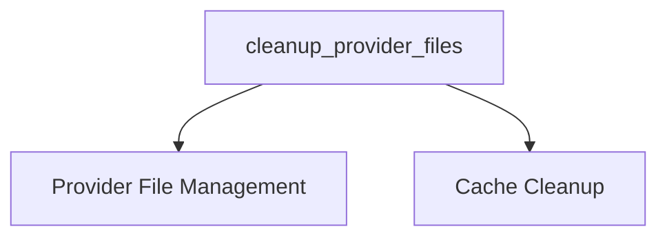

# sync_file_cleanup Module Documentation

## Introduction

The `sync_file_cleanup` module is a vital part of the `crewai_files_cache` system, specifically responsible for the synchronous deletion of files associated with various providers. It offers functionality to either clear all files belonging to a specific provider or remove only those entries that are present in the cache.

This module ensures efficient management of cached files, preventing accumulation and maintaining system hygiene by providing a direct, synchronous mechanism for file removal.

## Architecture and Component Relationships

The `sync_file_cleanup` module's core functionality revolves around the `cleanup_provider_files` function. This function orchestrates the deletion process by interacting with an `uploader` interface, obtained from the [provider_file_management](provider_file_management.md) module, and optionally managing entries within an `UploadCache` provided by the [cache_cleanup](cache_cleanup.md) module.

<!-- DIAGRAM_JSON
{
    "direction": "TD",
    "nodes": [
        {"id": "sync_cleanup_function", "label": "cleanup_provider_files", "type": "component", "link": null},
        {"id": "provider_file_management", "label": "Provider File Management", "type": "external", "link": "provider_file_management.md"},
        {"id": "cache_cleanup", "label": "Cache Cleanup", "type": "external", "link": "cache_cleanup.md"}
    ],
    "edges": [
        {"source": "sync_cleanup_function", "target": "provider_file_management"},
        {"source": "sync_cleanup_function", "target": "cache_cleanup"}
    ],
    "groups": []
}
-->


### Core Components

#### `cleanup_provider_files` Function

```python
def cleanup_provider_files(
    provider: ProviderType,
    *,
    cache: UploadCache | None = None,
    delete_all_from_provider: bool = False,
) -> int:
    """Clean up all files for a specific provider.

    Args:
        provider: Provider name to clean up.
        cache: Optional upload cache to clear entries from.
        delete_all_from_provider: If True, delete all files from the provider,
            not just cached ones.

    Returns:
        Number of files deleted.
    """
    deleted = 0
    uploader = get_uploader(provider)

    if uploader is None:
        logger.warning(f"No uploader available for {provider}")
        return 0

    if delete_all_from_provider:
        try:
            files = uploader.list_files()
            for file_info in files:
                file_id = file_info.get("id") or file_info.get("name")
                if file_id and uploader.delete(file_id):
                    deleted += 1
        except Exception as e:
            logger.warning(f"Error listing/deleting files from {provider}: {e}")
    elif cache is not None:
        uploads = cache.get_all_for_provider(provider)
        for upload in uploads:
            if _safe_delete(uploader, upload.file_id, provider):
                deleted += 1
                cache.remove_by_file_id(upload.file_id, provider)

    logger.info(f"Deleted {deleted} files from {provider}")
    return deleted
```

This function is the primary entry point for synchronous file cleanup. It determines the appropriate uploader for a given `provider` and proceeds with file deletion based on the `delete_all_from_provider` flag or by consulting the `cache`.

-   **Provider Interaction:** It uses `get_uploader(provider)` to retrieve a provider-specific uploader object. This object is expected to implement `list_files()` and `delete(file_id)` methods.
-   **Cache Interaction:** If a `cache` is provided and `delete_all_from_provider` is false, it fetches cached uploads for the provider and attempts to delete them one by one, also removing them from the cache upon successful deletion. The `_safe_delete` helper (not detailed here but implied) likely encapsulates error handling for individual file deletions.
-   **Error Handling:** Includes basic error handling for uploader operations and logs warnings for issues encountered during file listing or deletion.

## How the Module Fits into the Overall System

The `sync_file_cleanup` module is an integral part of the `crewai_files_cache` subsystem, specifically nested within the `cache_cleanup` and `provider_file_management` modules. Its role is to provide a synchronous mechanism for ensuring that files stored by various providers, particularly those managed by the caching system, are properly removed when no longer needed.

It works in tandem with the [async_file_cleanup](async_file_cleanup.md) module, offering a complementary approach to file deletion. While `async_file_cleanup` might handle background or deferred cleanup tasks, `sync_file_cleanup` is designed for immediate, on-demand file removal. This dual approach ensures flexibility and responsiveness in managing cached resources across different operational contexts within the CrewAI framework.

By centralizing provider-specific file cleanup logic, this module contributes to the overall stability and resource efficiency of the CrewAI application, preventing orphaned files and managing storage effectively.