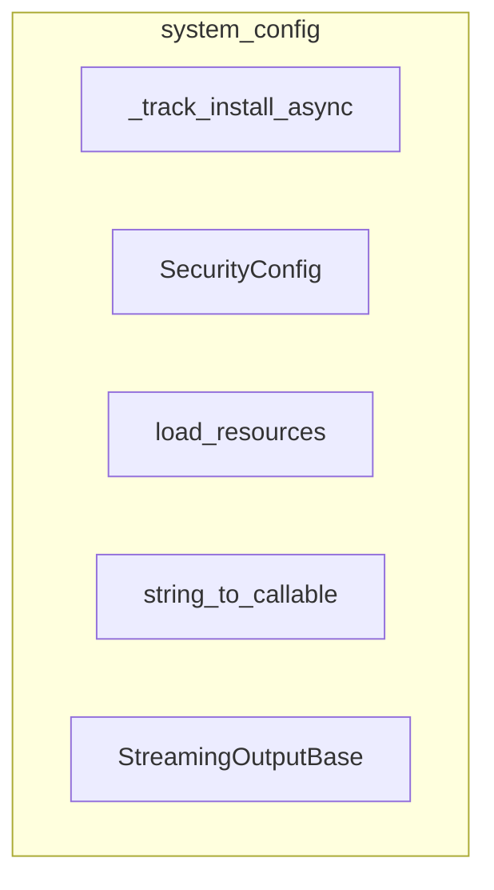

# system_config
This module provides essential system configuration and utility components, covering aspects like installation tracking, security settings, resource management, callback resolution, and streaming output processing.

<!-- DIAGRAM_JSON
{
    "nodes": [
        {
            "id": "A",
            "label": "_track_install_async",
            "type": "function"
        },
        {
            "id": "B",
            "label": "SecurityConfig",
            "type": "class"
        },
        {
            "id": "C",
            "label": "load_resources",
            "type": "function"
        },
        {
            "id": "D",
            "label": "string_to_callable",
            "type": "function"
        },
        {
            "id": "E",
            "label": "StreamingOutputBase",
            "type": "class"
        }
    ],
    "edges": [],
    "groups": [
        {
            "id": "system_config",
            "label": "system_config",
            "nodes": [
                "A",
                "B",
                "C",
                "D",
                "E"
            ]
        }
    ]
}
-->
