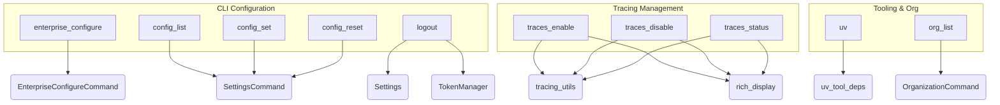

# system_config_and_tracing
This module provides command-line interface functionalities for managing CrewAI system configurations, including enterprise settings, general CLI parameters, organization listings, user authentication, and comprehensive tracing controls.

<!-- DIAGRAM_JSON
{
  "nodes": [
    {"id": "A", "label": "enterprise_configure"},
    {"id": "B", "label": "uv"},
    {"id": "C", "label": "config_list"},
    {"id": "D", "label": "config_set"},
    {"id": "E", "label": "config_reset"},
    {"id": "F", "label": "org_list"},
    {"id": "G", "label": "logout"},
    {"id": "H", "label": "traces_enable"},
    {"id": "I", "label": "traces_disable"},
    {"id": "J", "label": "traces_status"},
    {"id": "K", "label": "EnterpriseConfigureCommand"},
    {"id": "L", "label": "SettingsCommand"},
    {"id": "M", "label": "OrganizationCommand"},
    {"id": "N", "label": "Settings"},
    {"id": "O", "label": "TokenManager"},
    {"id": "P", "label": "tracing_utils"},
    {"id": "Q", "label": "rich_display"},
    {"id": "R", "label": "uv_tool_deps"}
  ],
  "edges": [
    {"source": "A", "target": "K"},
    {"source": "B", "target": "R"},
    {"source": "C", "target": "L"},
    {"source": "D", "target": "L"},
    {"source": "E", "target": "L"},
    {"source": "F", "target": "M"},
    {"source": "G", "target": "N"},
    {"source": "G", "target": "O"},
    {"source": "H", "target": "P"},
    {"source": "H", "target": "Q"},
    {"source": "I", "target": "P"},
    {"source": "I", "target": "Q"},
    {"source": "J", "target": "P"},
    {"source": "J", "target": "Q"}
  ],
  "groups": [
    {"id": "grp_config", "label": "CLI Configuration", "nodes": ["A", "C", "D", "E", "G"]},
    {"id": "grp_tracing", "label": "Tracing Management", "nodes": ["H", "I", "J"]},
    {"id": "grp_tooling", "label": "Tooling & Org", "nodes": ["B", "F"]}
  ]
}
-->
