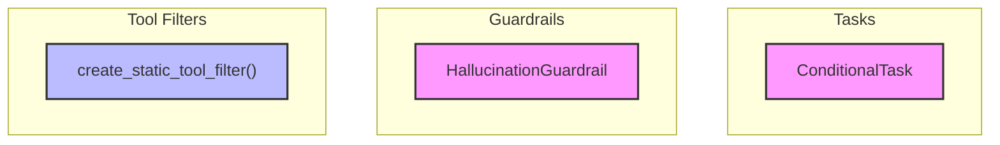

# task_and_guardrail_tools
This module provides components for dynamic task execution, including conditional task logic, a placeholder for hallucination detection, and a utility for creating static tool filters.

<!-- DIAGRAM_JSON
{
  "nodes": [
    {
      "id": "ConditionalTask",
      "label": "ConditionalTask",
      "type": "class"
    },
    {
      "id": "HallucinationGuardrail",
      "label": "HallucinationGuardrail",
      "type": "class"
    },
    {
      "id": "create_static_tool_filter",
      "label": "create_static_tool_filter",
      "type": "function"
    }
  ],
  "edges": [],
  "groups": [
    {
      "id": "Tasks",
      "label": "Tasks",
      "nodes": ["ConditionalTask"]
    },
    {
      "id": "Guardrails",
      "label": "Guardrails",
      "nodes": ["HallucinationGuardrail"]
    },
    {
      "id": "ToolFilters",
      "label": "Tool Filters",
      "nodes": ["create_static_tool_filter"]
    }
  ]
}
-->
