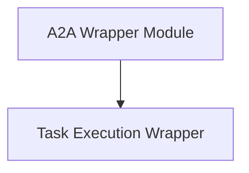

# Task Execution Wrapper Module

## Introduction
The `task_execution_wrapper` module is a crucial component within the CrewAI framework, specifically designed to extend the task execution capabilities of agents with Agent-to-Agent (A2A) delegation support. It provides a standardized way to execute tasks, allowing agents to delegate sub-tasks to other agents within a crew, thereby enabling more complex and collaborative workflows. This module handles both synchronous and asynchronous task execution, ensuring seamless integration with various operational contexts.

## Architecture Overview
The `task_execution_wrapper` module integrates with the broader [a2a_wrapper](a2a_wrapper.md) module, which manages the overall A2A communication and delegation mechanisms. This module acts as a specialized layer for invoking task execution within an A2A-enabled environment.

<!-- DIAGRAM_JSON
{
    "direction": "TD",
    "nodes": [
        {"id": "a2a_wrapper", "label": "A2A Wrapper Module", "type": "module", "link": "a2a_wrapper.md"},
        {"id": "task_execution_wrapper", "label": "Task Execution Wrapper", "type": "module", "link": "task_execution_wrapper.md"}
    ],
    "edges": [
        {"source": "a2a_wrapper", "target": "task_execution_wrapper"}
    ],
    "groups": []
}
-->

## Core Functionality

This module provides the core logic for executing tasks with A2A delegation:

### `aexecute_task_with_a2a`
- **Description**: This asynchronous function enables an agent to execute a given task with the added capability of A2A delegation. If A2A is not configured for the agent, it falls back to the original asynchronous task execution.
- **Components**: `lib.crewai.src.crewai.a2a.wrapper.aexecute_task_with_a2a`

### `execute_task_with_a2a`
- **Description**: This synchronous function allows an agent to execute a task, incorporating A2A delegation where configured. Similar to its asynchronous counterpart, it reverts to standard task execution if A2A is not enabled.
- **Components**: `lib.crewai.src.crewai.a2a.wrapper.execute_task_with_a2a`
