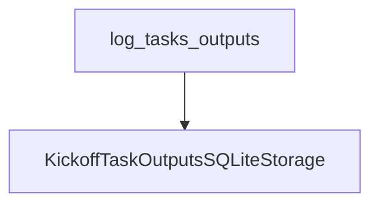

# `task_output_management` Module Documentation

The `task_output_management` module is a vital component within the CrewAI CLI, specifically designed to handle the retrieval and display of task outputs generated by `crew.kickoff()` executions. It provides a convenient interface for developers and maintainers to inspect the results of their crew's operations directly from the command line, facilitating debugging, monitoring, and understanding of task flows.

### Module Purpose and Core Functionality

The primary purpose of `task_output_management` is to offer a straightforward way to access and visualize the outputs of tasks managed by the CrewAI system. Its core functionality revolves around the `log_tasks_outputs` component, which interacts with a persistent storage mechanism to fetch and present the most recent task outputs. This ensures that users can quickly review what their AI agents have produced, making it easier to track progress and identify any issues.

#### `log_tasks_outputs` Component

The `log_tasks_outputs` function is the central piece of this module. It is responsible for:
1.  **Retrieving Task Outputs:** It instantiates `KickoffTaskOutputsSQLiteStorage` to load previously stored task outputs. This implies a reliance on a SQLite database for persistence.
2.  **Displaying Outputs:** It iterates through the retrieved tasks, printing their unique IDs, expected outputs, and a separator for readability.
3.  **Error Handling:** It includes a `try-except` block to gracefully handle any exceptions that might occur during the retrieval or logging process, providing informative error messages to the user.
4.  **No Output Scenario:** If no task outputs are found in storage, it informs the user that only crew kickoff task outputs are logged and none were found.

**Code:**
```python
def log_tasks_outputs() -> None:
    """
    Retrieve your latest crew.kickoff() task outputs.
    """
    try:
        storage = KickoffTaskOutputsSQLiteStorage()
        tasks = storage.load()

        if not tasks:
            click.echo(
                "No task outputs found. Only crew kickoff task outputs are logged."
            )
            return

        for index, task in enumerate(tasks, 1):
            click.echo(f"Task {index}: {task['task_id']}")
            click.echo(f"Description: {task['expected_output']}")
            click.echo("------")

    except Exception as e:
        click.echo(f"An error occurred while logging task outputs: {e}", err=True)
```

### Architecture and Component Relationships

The `task_output_management` module is a leaf module within the `crewai_cli.memory_and_output_utilities` structure. It contains the `log_tasks_outputs` function, which depends on `KickoffTaskOutputsSQLiteStorage` for data access. `KickoffTaskOutputsSQLiteStorage` is likely managed or defined within the [memory_management](memory_management.md) module, which is a sibling of `task_output_management` within `memory_and_output_utilities`.

<!-- DIAGRAM_JSON
{
    "direction": "TD",
    "nodes": [
        {"id": "log_tasks_outputs", "label": "log_tasks_outputs", "type": "component", "link": null},
        {"id": "kickoff_task_outputs_sqlite_storage", "label": "KickoffTaskOutputsSQLiteStorage", "type": "external", "link": "memory_management.md"}
    ],
    "edges": [
        {"source": "log_tasks_outputs", "target": "kickoff_task_outputs_sqlite_storage"}
    ],
    "groups": []
}
-->


### How the Module Fits into the Overall System

The `task_output_management` module is an integral part of the `crewai_cli`, residing under the `memory_and_output_utilities` section. Its primary role is to expose task output logging capabilities to the command-line interface, allowing users to easily inspect the results of their crew's work.

It complements the [memory_management](memory_management.md) module by focusing specifically on the presentation of task outputs, while `memory_management` likely handles the underlying persistence and retrieval mechanisms. This clear separation of concerns ensures that the CLI remains modular and maintainable. By providing direct access to task outputs, `task_output_management` significantly enhances the developer experience when building and debugging CrewAI applications.