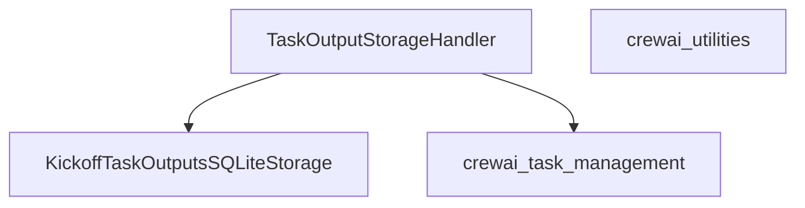

# task_output_persistence Module Documentation

## Introduction

The `task_output_persistence` module is responsible for managing the storage and retrieval of task execution outputs within the CrewAI system. It provides a robust mechanism to persist task results, enabling functionalities such as task replay, auditing, and maintaining a historical record of agent activities. This module acts as a crucial backbone for ensuring the integrity and traceability of task outcomes.

## Architecture and Component Relationships

The `task_output_persistence` module centers around the `TaskOutputStorageHandler` component, which serves as the primary interface for interacting with task output storage. It leverages an internal SQLite-based storage implementation to handle the actual persistence operations.

<!-- DIAGRAM_JSON
{
    "direction": "TD",
    "nodes": [
        {"id": "task_output_storage_handler", "label": "TaskOutputStorageHandler", "type": "component", "link": null},
        {"id": "kickoff_task_outputs_sqlite_storage", "label": "KickoffTaskOutputsSQLiteStorage", "type": "component", "link": null},
        {"id": "crewai_task_management", "label": "crewai_task_management", "type": "external", "link": "crewai_task_management.md"},
        {"id": "crewai_utilities", "label": "crewai_utilities", "type": "external", "link": "crewai_utilities.md"}
    ],
    "edges": [
        {"source": "task_output_storage_handler", "target": "kickoff_task_outputs_sqlite_storage"},
        {"source": "task_output_storage_handler", "target": "crewai_task_management"}
    ],
    "groups": []
}
-->

## Module Components

### TaskOutputStorageHandler

`TaskOutputStorageHandler` is the main class in this module, offering methods to manage the lifecycle of task outputs.

*   **Purpose**: Manages the storage, retrieval, updating, and clearing of task execution results.
*   **Key Responsibilities**: 
    *   Initializes and interacts with `KickoffTaskOutputsSQLiteStorage` for data persistence.
    *   Provides methods to add new task outputs, update existing ones (especially for replayed tasks), reset all stored outputs, and load them.
*   **Methods**:
    *   `__init__()`: Initializes the handler, instantiating `KickoffTaskOutputsSQLiteStorage`.
    *   `update(task_index: int, log: dict[str, Any])`: Updates an existing task's output. It differentiates between initial execution and replayed tasks to store relevant information.
    *   `add(task: Task, output: dict[str, Any], task_index: int, inputs: dict[str, Any] | None = None, was_replayed: bool = False)`: Adds a new task output, including the task object, its output, index, inputs, and a flag indicating if it was replayed.
    *   `reset()`: Clears all task outputs currently stored.
    *   `load() -> list[dict[str, Any]] | None`: Retrieves all stored task outputs.

### KickoffTaskOutputsSQLiteStorage

This is an internal component that `TaskOutputStorageHandler` uses for the actual data storage. While its code is not detailed here, it is responsible for the low-level SQLite operations for adding, updating, deleting, and loading task output records. It is a concrete implementation of the storage mechanism.

## Integration with the Overall System

The `task_output_persistence` module is a sub-module of `crewai_utilities.output_handling` which is part of the broader [crewai_utilities](crewai_utilities.md) module. It plays a vital role in the CrewAI framework by ensuring that the results of agent tasks are reliably stored and accessible. This persistence is fundamental for:

*   **Task Replay**: Stored outputs allow for re-executing or analyzing past task runs.
*   **Auditing and Debugging**: Provides a clear trail of task executions, outputs, and inputs, which is invaluable for debugging and auditing agent behavior.
*   **System Resilience**: Ensures that task outputs are not lost across application restarts or system failures.

It interacts with `Task` objects, likely defined within the [crewai_task_management](crewai_task_management.md) or [crewai_core_types](crewai_core_types.md) module, to understand the structure of the tasks it's persisting.