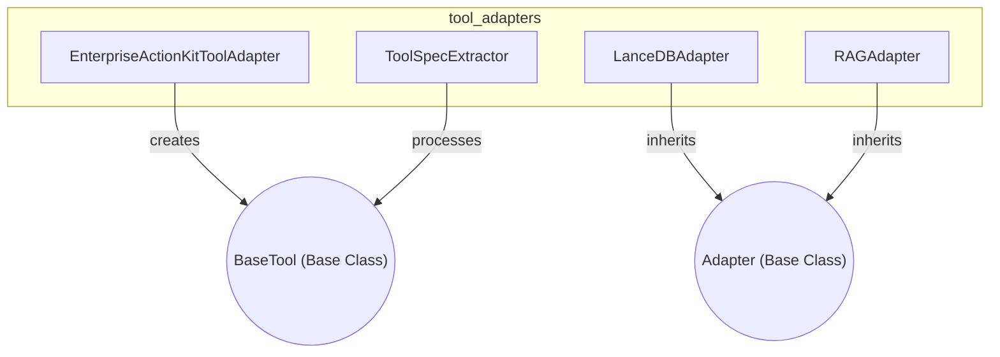

# tool_adapters
This module provides various adapters for integrating external tools and services, alongside a utility for extracting specifications from tool classes.

<!-- DIAGRAM_JSON
{
  "nodes": [
    { "id": "EAKA", "label": "EnterpriseActionKitToolAdapter" },
    { "id": "LDBA", "label": "LanceDBAdapter" },
    { "id": "RAGA", "label": "RAGAdapter" },
    { "id": "TSE", "label": "ToolSpecExtractor" },
    { "id": "Adapter", "label": "Adapter (Base Class)", "style": "dashed" },
    { "id": "BaseTool", "label": "BaseTool (Base Class)", "style": "dashed" }
  ],
  "edges": [
    { "source": "LDBA", "target": "Adapter", "label": "inherits", "type": "inheritance" },
    { "source": "RAGA", "target": "Adapter", "label": "inherits", "type": "inheritance" },
    { "source": "EAKA", "target": "BaseTool", "label": "creates", "type": "dependency" },
    { "source": "TSE", "target": "BaseTool", "label": "processes", "type": "dependency" }
  ],
  "groups": [
    {
      "id": "tool_adapters",
      "label": "tool_adapters",
      "nodes": ["EAKA", "LDBA", "RAGA", "TSE"]
    }
  ]
}
-->
