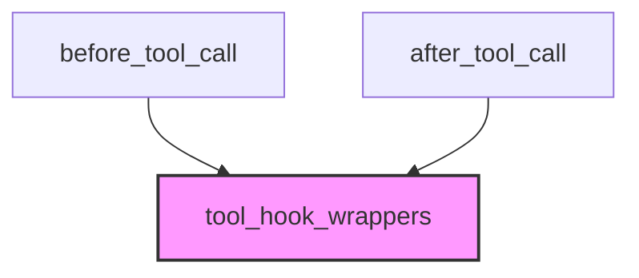

# Module: `tool_call_decorators`

## Introduction
The `tool_call_decorators` module provides decorators to register functions as hooks that execute either before or after a tool call within the CrewAI framework. These hooks allow for custom logic, such as logging, human approval, or result sanitization, to be injected into the tool execution lifecycle.

## Core Functionality

This module exposes two primary decorators: `before_tool_call` and `after_tool_call`. Both leverage a common internal mechanism (`_create_hook_decorator`) to register the decorated functions with the CrewAI hook system.

### `before_tool_call`

The `before_tool_call` decorator registers a function to be executed *before* a tool is called. The decorated function receives a `ToolCallHookContext` object, which provides information about the tool call. The hook can optionally return `False` to prevent the tool from being executed, or `None` to allow execution to proceed.

#### Parameters
- `func` (Callable[[ToolCallHookContext], bool | None]): The function to be registered as a before-tool-call hook.
- `tools` (list[str], optional): A list of tool names for which this hook should be active. If `None`, the hook applies to all tools.
- `agents` (list[str], optional): A list of agent names for which this hook should be active. If `None`, the hook applies to all agents.

#### Example Usage

```python
@before_tool_call
def log_all_tools(context):
    print(f"Tool: {context.tool_name}")
    return None

@before_tool_call(tools=["delete_file", "execute_code"])
def approve_dangerous(context):
    response = context.request_human_input(prompt="Approve?")
    return None if response == "yes" else False

@before_tool_call(tools=["write_file"], agents=["Developer"])
def approve_dev_writes(context):
    return None  # Only for Developer writing files
```

### `after_tool_call`

The `after_tool_call` decorator registers a function to be executed *after* a tool has been called and its result is available. The decorated function receives a `ToolCallHookContext` object, which includes the `tool_result`. The hook can optionally return a `str` to modify the tool's result, or `None` to keep the original result.

#### Parameters
- `func` (Callable[[ToolCallHookContext], str | None]): The function to be registered as an after-tool-call hook.
- `tools` (list[str], optional): A list of tool names for which this hook should be active. If `None`, the hook applies to all tools.
- `agents` (list[str], optional): A list of agent names for which this hook should be active. If `None`, the hook applies to all agents.

#### Example Usage

```python
@after_tool_call
def log_results(context):
    print(f"Result: {len(context.tool_result)} chars")
    return None

@after_tool_call(tools=["web_search", "ExaSearchTool"])
def sanitize_search_results(context):
    if "SECRET" in context.tool_result:
        return context.tool_result.replace("SECRET", "[REDACTED]")
    return None
```

## Architecture and Component Relationships

This module relies on the `tool_hook_wrappers` module for the `ToolCallHookContext` and the actual registration functions for the hooks. The decorators provided here act as an interface to simplify the process of defining and applying these hooks.

<!-- DIAGRAM_JSON
{
    "direction": "TD",
    "nodes": [
        {"id": "before_tool_call", "label": "before_tool_call", "type": "component", "link": null},
        {"id": "after_tool_call", "label": "after_tool_call", "type": "component", "link": null},
        {"id": "tool_hook_wrappers", "label": "tool_hook_wrappers", "type": "external", "link": "tool_hook_wrappers.md"}
    ],
    "edges": [
        {"source": "before_tool_call", "target": "tool_hook_wrappers"},
        {"source": "after_tool_call", "target": "tool_hook_wrappers"}
    ],
    "groups": []
}
-->


## How the Module Fits into the Overall System

The `tool_call_decorators` module is a crucial part of the `crewai_hooks_system`, specifically within the `tool_hook_decorators` sub-module. It provides a declarative way for developers to extend the functionality of tool execution in CrewAI agents without modifying the core tool logic. By using these decorators, developers can implement cross-cutting concerns such as security checks, logging, and human intervention points, enhancing the flexibility and control over how tools are utilized by agents. This module contributes significantly to the extensibility of the CrewAI framework.
