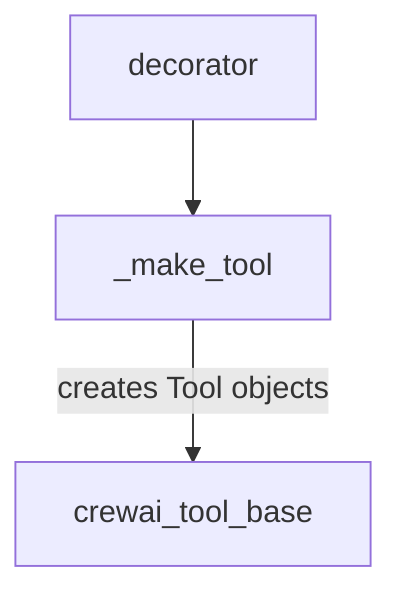

# `tool_creation_logic` Module Documentation

## Introduction

The `tool_creation_logic` module is a fundamental part of the CrewAI framework, responsible for transforming standard Python functions into structured `Tool` objects that can be understood and utilized by AI agents. It extracts essential metadata such as names, descriptions (from docstrings), and argument schemas (from type annotations) to enable dynamic tool definition.

## Architecture and Component Relationships

This module primarily consists of two core components: `_make_tool` and `decorator`. The `decorator` serves as a convenient way to apply the tool transformation logic to functions, which then relies on `_make_tool` to perform the actual conversion.

`_make_tool` is responsible for parsing function signatures, extracting docstrings for tool descriptions, and generating a Pydantic model for the tool's arguments based on type annotations and default values. This structured approach ensures that tools have clear interfaces for agents to interact with.

This module is a leaf module within the `crewai_tool_base` hierarchy, specifically nested under `tool_definition`. It is crucial for the overall [crewai_tool_base](crewai_tool_base.md) module's functionality by providing the core mechanism for dynamic tool creation.

<!-- DIAGRAM_JSON
{
    "direction": "TD",
    "nodes": [
        {"id": "_make_tool", "label": "_make_tool", "type": "component", "link": null},
        {"id": "decorator", "label": "decorator", "type": "component", "link": null},
        {"id": "crewai_tool_base", "label": "crewai_tool_base", "type": "external", "link": "crewai_tool_base.md"}
    ],
    "edges": [
        {"source": "decorator", "target": "_make_tool"},
        {"source": "_make_tool", "target": "crewai_tool_base", "label": "creates Tool objects"}
    ],
    "groups": []
}
-->

## Core Components

### `_make_tool`

`_make_tool` is the primary function responsible for converting a callable Python function into a `Tool` instance. It performs the following key actions:

1.  **Docstring Validation**: Ensures the input function has a docstring, which is used as the tool's description.
2.  **Type Annotation Validation**: Verifies that the function has type annotations, which are crucial for generating the argument schema.
3.  **Argument Schema Generation**: Inspects the function's signature to extract parameter names, types, and default values. It then uses this information to dynamically create a Pydantic `args_schema` for the tool.
4.  **Tool Instantiation**: Constructs and returns a `Tool` object, encapsulating the function, its name, description, generated argument schema, and other metadata like `result_as_answer` and `max_usage_count`.

### `decorator`

The `decorator` component provides a convenient syntactic sugar for applying the `_make_tool` logic. When used as a decorator (`@tool_decorator`), it automatically takes the decorated function and passes it to the `_make_tool` function (or an internal variant like `_make_with_name` which wraps `_make_tool`), simplifying the process of creating tools from regular Python functions. This allows developers to easily define new tools within the CrewAI framework by simply decorating their functions.
