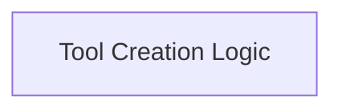

# Tool Definition Module

## Introduction
The `tool_definition` module is a core component within the `crewai_tool_base` package, specifically designed for the dynamic creation and management of tools based on Python functions. It provides the foundational mechanisms for converting regular functions into structured `Tool` instances, complete with automatically generated argument schemas and detailed descriptions derived from docstrings.

## Architecture
The `tool_definition` module is structured to provide a clear and efficient way to define and prepare functions for use as tools within the CrewAI framework. It primarily consists of a logical sub-module that handles the intricate process of tool creation.

<!-- DIAGRAM_JSON
{
    "direction": "TD",
    "nodes": [
        {"id": "tool_creation_logic", "label": "Tool Creation Logic", "type": "module", "link": "tool_creation_logic.md"}
    ],
    "edges": [],
    "groups": []
}
-->

## Sub-modules

### [Tool Creation Logic](tool_creation_logic.md)
This sub-module encapsulates the core logic for transforming Python functions into usable tool instances. It is responsible for parsing function signatures, extracting docstrings, and generating Pydantic models for tool arguments, ensuring that tools are well-defined and can be properly invoked by the CrewAI agents.

