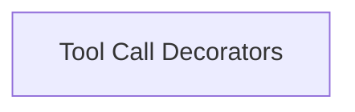

# Tool Hook Decorators

The `tool_hook_decorators` module provides decorators for registering functions as hooks that are executed before or after a tool call within the CrewAI framework. These hooks allow developers to inject custom logic, such as logging, human approval, or result sanitization, directly into the tool execution lifecycle.

## Architecture

This module primarily consists of decorators that facilitate the registration of tool-specific callbacks. It integrates with the larger [CrewAI Hooks System](crewai_hooks_system.md) to manage and execute these hooks.

<!-- DIAGRAM_JSON
{
    "direction": "TD",
    "nodes": [
        {"id": "tool_call_decorators", "label": "Tool Call Decorators", "type": "module", "link": "tool_call_decorators.md"}
    ],
    "edges": [],
    "groups": []
}
-->

## Sub-modules

### [Tool Call Decorators](tool_call_decorators.md)
This sub-module contains the core decorators, `before_tool_call` and `after_tool_call`, which enable the registration of custom functions to be executed at specific points during a tool's lifecycle. These decorators provide flexible filtering options based on tool names or agent names, allowing for fine-grained control over when and how hooks are applied.