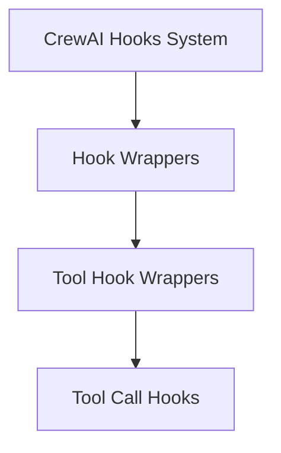

# Tool Hook Wrappers Module

The `tool_hook_wrappers` module provides essential mechanisms for integrating custom logic before and after tool calls within the CrewAI framework. It defines wrapper classes that enable methods within `@CrewBase` classes to act as hooks, allowing for flexible extension and monitoring of tool execution.

## Architecture Overview

This module primarily consists of wrappers for different stages of tool calls. The architecture is designed to be modular, allowing for clear separation of concerns between defining a hook and the method that implements its logic.

<!-- DIAGRAM_JSON
{
    "direction": "TD",
    "nodes": [
        {"id": "crewai_hooks_system", "label": "CrewAI Hooks System", "type": "module", "link": "crewai_hooks_system.md"},
        {"id": "hook_wrappers", "label": "Hook Wrappers", "type": "module", "link": "hook_wrappers.md"},
        {"id": "tool_hook_wrappers", "label": "Tool Hook Wrappers", "type": "module", "link": "tool_hook_wrappers.md"},
        {"id": "tool_call_hooks", "label": "Tool Call Hooks", "type": "module", "link": "tool_call_hooks.md"}
    ],
    "edges": [
        {"source": "crewai_hooks_system", "target": "hook_wrappers"},
        {"source": "hook_wrappers", "target": "tool_hook_wrappers"},
        {"source": "tool_hook_wrappers", "target": "tool_call_hooks"}
    ],
    "groups": []
}
-->

## Sub-modules

### [Tool Call Hooks](tool_call_hooks.md)
This sub-module contains the core wrapper classes, `BeforeToolCallHookMethod` and `AfterToolCallHookMethod`, which facilitate the execution of custom logic before and after tool invocations within the CrewAI system. They allow developers to specify target tools and agents for their hooks, providing granular control over when and where these custom behaviors are applied.

## How it Fits into the Overall System

The `tool_hook_wrappers` module is a critical part of the broader [CrewAI Hooks System](crewai_hooks_system.md). It provides the foundational elements for defining and managing hooks specifically related to tool interactions. By leveraging these wrappers, agents and crews can be equipped with enhanced observability, control, and customizability during their operation, enabling functionalities like logging, validation, or dynamic modification of tool inputs/outputs. This module ensures that the execution flow of tools can be programmatically intercepted and extended, contributing to a more robust and adaptable AI system.

Refer to the main [Hook Wrappers](hook_wrappers.md) module documentation for more details on other hook types and their management.

