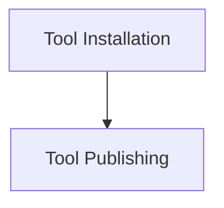

# Tool Lifecycle Management

The `tool_lifecycle_management` module, located within `crewai_cli.tool_management`, is responsible for handling the essential stages of a tool's lifecycle: installation and publishing. It provides command-line functionalities to integrate new tools into the CrewAI ecosystem and to make existing tools available for wider use.

## Architecture Overview

This module primarily interacts with a `ToolCommand` utility (likely defined within the `crewai_cli` module) to execute its core functionalities. It exposes two main operations: `tool_install` and `tool_publish`, each managed by dedicated sub-modules.

<!-- DIAGRAM_JSON
{
    "direction": "TD",
    "nodes": [
        {"id": "tool_installation", "label": "Tool Installation", "type": "module", "link": "tool_installation.md"},
        {"id": "tool_publishing", "label": "Tool Publishing", "type": "module", "link": "tool_publishing.md"}
    ],
    "edges": [
        {"source": "tool_installation", "target": "tool_publishing"}
    ],
    "groups": []
}
-->

## Sub-modules

### [Tool Installation](tool_installation.md)
This sub-module (`tool_installation.md`) encapsulates the logic for installing tools. It handles the necessary authentication and delegates to the underlying `ToolCommand` to perform the installation based on a provided tool handle.

### [Tool Publishing](tool_publishing.md)
This sub-module (`tool_publishing.md`) manages the process of publishing tools. It includes functionalities for authentication and allows users to specify whether the tool should be made public and if the publication should be forced.